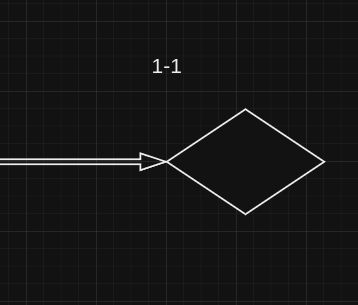
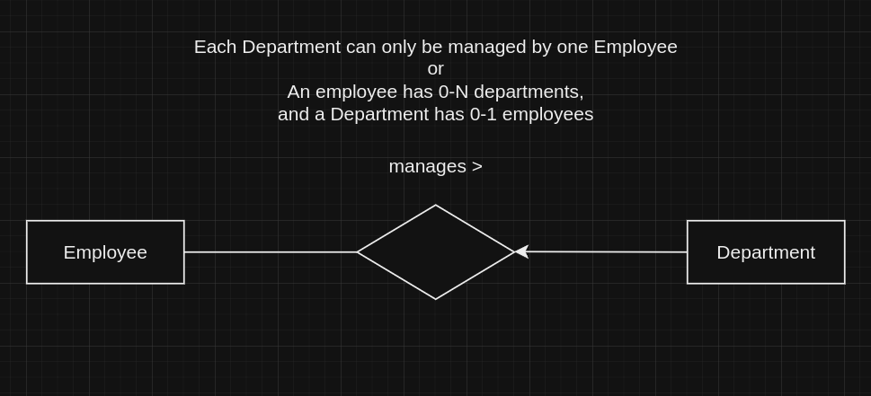

# Databases summary
This summary was made as a way to study for my exam, and definitely not to use it to copy during the exam!<br>
**Contents**:
1. [Databases and Database Management Systems](#databases-and-database-management-systems-dbms)
    * [Database](#database)
    * [Database Management System](#database-management-system-dbms)
    * [Architecture](#ansisparc-dbms-architecture)
    * [Data Model](#data-models)
    * [Database Design](#database-design)
2. [SQL](#structured-query-language-sql)
    * [Basic](#sql-in-practice-basic)
    * [Advanced](#sql-in-practice-advanced)
3. [E-A](#e-a-model)
4. [E-A Conversion](#e-a-relational-conversion)

## Databases and Database Management Systems (DBMS)
### Database
A **database** is an organized collection of data, structured to facilitate the storage, retrieval, modification, and deletion of data, that is often organized into **tables**, rows, and columns.

### Database Management System (DBMS)
A **Database Management System** is a software system that provides an interface for users to interact with databases. It manages data, the database engine, and the database schema, facilitating the organization, storage, and retrieval of data.<br>

**Advantages** of DBMS:
- **Data Security**: Provides mechanisms for data access control, user authentication, and authorization.
- **Transaction Management**: Ensures data integrity and consistency through ACID properties (Atomicity, Consistency, Isolation, Durability).
- **Backup and Recovery**: Offers tools for backing up data and recovering it in case of system failures.
- **Concurrency Control**: Manages concurrent data access by multiple users to ensure data consistency and integrity.
- **Data Independence**: There is an abstraction layer between the representation of data when it is stored and what applications have access to.
- **Efficient Data Access**: At the storage level, DBMSs use several sophisticated techniques to make data storage and collection an efficient process. 
- **Data Integrity**: Constraints and rules, ensuring data accuracy and consistency. Unlike other forms of data storage, such as files.
- **Persistent Storage**: When we use a DBMS we are sure that, when we finish executing an instruction (e.g. insert, update, delete, etc.), that instruction was executed and saved persistently. If there is a failure immediately after executing any instruction, we are guaranteed that we will not lose this data.
- **Data Administration**: Allows separation of functions: whoever develops the application does not need to be the same person who manages the database. Thus, you can have a much more experienced professional just focused on the DBMS, improving data storage and collection.
- **Reducing Application Development Time**: With all the tools made available by a DBMS, as well as their own interrogation languages ​​dedicated to data (e.g. SQL), the work of programmers is immensely easier. These languages ​​provide a high-level interface for data, which, as we have already seen, allow the creation of various abstractions that simplify application development.

**Disadvantages** of DBMS:
- **Complex Applications**: Sometimes, we can have very complex applications in which it is not possible for us to model our data in a relational system.
- **Unacceptable Performance (e.g. for real-time applications)**: For some applications, such as a stock market, data changes so quickly that the performance of the DBMS is not sufficient.
- **Lack of Flexible Analysis for Certain Data Types**: Mostly for text, where we may want to do advanced searches (e.g. full text search, fuzzy search), something that most DBMSs do not support.
- **Lack of necessity**: For extremely simple applications or with mostly immutable data, it may not make sense to introduce a DBMS, no matter how small the overhead of doing so may be nowadays. An application of this type would not benefit from a DBMS.

### ANSI/SPARC DBMS Architecture
Defines a three-level architecture for database systems, designed to separate the user's view of the database from the physical storage of data, enhancing data abstraction, independence, and flexibility.<br>


1. **External Level** - describes how users see data:
    - **User Views**: The external level represents the user's view of the database. It includes multiple external schemas or user views, which define how individual users or groups of users see the data.
    - **Customization**: Each user can have a customized view that includes only the data relevant to their specific needs, which can enhance security by restricting access to sensitive data.
    - **Data Independence**: Changes at the external level do not affect the conceptual or internal levels, providing logical data independence.

2. **Conceptual Level** - projects into the logical structure:
    - **Community View**: The conceptual level represents the community view of the database. It provides a unified and abstracted view of the entire database, independent of how data is stored physically.
    - **Conceptual Schema**: This level includes the conceptual schema, which defines the logical structure of the entire database, including entities, attributes, relationships, constraints, and security.
    - **Data Integrity**: Ensures the overall consistency, integrity, and correctness of the data.
    - **Data Independence**: Changes at the conceptual level do not affect the external or internal levels, providing physical data independence.

3. **Internal Level** - describes files (tables and indexes):
    - **Physical Storage**: The internal level represents the physical storage of the database. It includes the internal schema, which defines how the data is stored on the storage medium (e.g., hard drives, SSDs).
    - **Data Structures**: Details the physical data structures, such as indexes, file organizations, and storage methods.
    - **Optimization**: Handles data access paths, storage allocation, and optimization techniques to ensure efficient data retrieval and storage.
    - **Data Independence**: Changes at the internal level do not affect the conceptual or external levels.

#### Advantages of ANSI/SPARC Architecture
1. **Data Abstraction**: Separates the way data is viewed by users from the way it is stored, promoting clear data abstraction.
2. **Data Independence**: Provides both logical and physical data independence, allowing changes at one level without affecting others.
   - **Logical Data Independence**: Ability to change the conceptual schema without altering the external schemas or application programs.
   - **Physical Data Independence**: Ability to change the internal schema without altering the conceptual schema.
3. **Security and Privacy**: Enhances security by allowing different views for different users, ensuring that users only have access to data relevant to them.
4. **Consistency**: Maintains consistency and integrity across different user views and the physical storage of data.

#### Example of ANSI/SPARC Architecture in Action
- **External Level**: A university database might have different views for students, professors, and administrative staff. Students might see their courses and grades, professors might see courses they teach and student performance, and administrative staff might have a broader view including financial data.
- **Conceptual Level**: The unified schema might include entities like `Student`, `Professor`, `Course`, and `Enrollment`, with relationships and constraints defining how these entities interact.
- **Internal Level**: The actual data might be stored in various files, with indexes to speed up queries and data distributed across multiple storage devices for performance and reliability.

### Data Models
Data models define how data is structured, stored, and manipulated within a DBMS, providing a way to represent the logical structure of data, the relationships among data, and the constraints that apply to the data.
1. **Relational Data Model**
    - **Structure**: Data is organized into **tables** (relations) consisting of **rows** (tuples) and **columns** (attributes).
    
    ```sql
    user123=> select * from customer;
    customer_name | customer_street | customer_city  
    --------------+-----------------+----------------
    Adams         | Main Street     | Lisbon
    Brown         | Main Street     | Oporto
    Cook          | Main Street     | Lisbon
    Davis         | Church Street   | Oporto
    Evans         | Forest Street   | Coimbra
    Flores        | Station Street  | Braga
    Gonzalez      | Sunny Street    | Faro
    Iacocca       | Spring Steet    | Coimbra
    Johnson       | Red Street      | Cascais
    King          | Garden Street   | Aveiro
    Lopez         | Grand Street    | Vila R
    Martin        | Royal Street    | Braga
    Nguyen        | School Street   | Castelo Branco
    Oliver        | 1st Stret       | Oporto
    Parker        | Hope Street     | Oporto
    (15 rows)
    ```

2. **Semi-Structured**
    - It represents data in a flexible and hierarchical manner, often allowing for variability in the data structure. This model is particularly well-suited for data that doesn't fit neatly into rows and columns, such as documents, web pages, and various types of unstructured data.<br>

    **Examples of Semi-Structured Data Formats**

    1. **XML (eXtensible Markup Language):**
    - Hierarchical data format that uses tags to define elements and attributes.
    - Example:
        ```xml
        <person>
        <name>Jim Halpert</name>
        <email>johndoe@example.com</email>
        <phones>
            <phone type="home">123-456-7890</phone>
            <phone type="work">098-765-4321</phone>
        </phones>
        </person>
        ```

    2. **JSON (JavaScript Object Notation):**
    - Lightweight data-interchange format that's easy for humans to read and write and for machines to parse and generate.
    - Example:
        ```json
        {
        "name": "Jim Halpert",
        "email": "jimhalpert@gmail.com",
        "phones": {
            "home": "123-456-7890",
            "work": "098-765-4321"
        }
        }
        ```

    3. **YAML (YAML Ain't Markup Language):**
    - Human-readable data format that's often used for configuration files and data serialization.
    - Example:
        ```yaml
        name: Jim Halpert
        email: imhalpert@gmail.com
        phones:
        home: 123-456-7890
        work: 098-765-4321
        ```

3. **Entity-Relationship Model**
    - **Structure**: Data is modeled using **entities** (*objects*) and **relationships** between them, often represented diagrammatically.
    - **Usage**: Conceptual design phase, used to design databases before implementation.

4. **Hierarchical Data Model**
5. **Object-Oriented Data Model**
6. **Document Data Model**
7. **...**


### Database Design

1. **Requirements Specification**

    Gather and document detailed requirements from stakeholders, including data, functional, and non-functional requirements.

    - **Identify Stakeholders**: Determine who will use the database and gather requirements from them.
    - **Define Objectives**: Understand the purpose of the database, what problems it will solve, and what benefits it should provide.
    - **Data Requirements**: Identify what data needs to be stored, including data types, data volumes, and data relationships.
    - **Functional Requirements**: Define the operations that need to be supported, such as data entry, updates, deletions, and queries.
    - **Non-Functional Requirements**: Specify performance requirements, security needs, backup and recovery procedures, and constraints.

    **Example: University Database**

    - **Stakeholders**: Students, instructors, administrative staff.
    - **Objectives**: Manage student enrollment, course offerings, and grades.
    - **Data Requirements**: Store information about students, courses, instructors, and enrollments.
    - **Functional Requirements**: Register students for courses, assign grades, generate reports.
    - **Non-Functional Requirements**: Ensure data security, handle concurrent access, provide backup and recovery.

2. **Conceptual Model (Semantic Data Model)**
    
    High-level representation of the data and its relationships. It serves as a bridge between the requirements specification and the relational schema.
    The **semantic data model** provides a more abstract and user-centric view of data, which is a good starting point for database design.

    **Examples of Semantic Data Models**:

    1. **Entity-Association (E-A) Model**:
    Graphically describes entities and the relationships between them.
        - **Entities**: Represent objects or concepts (e.g., Student, Course).
        - **Attributes**: Properties of entities (e.g., StudentID, Name).
        - **Relationships**: Connections between entities (e.g., Enrolls, Teaches).

    2. **UML Class Diagram**:
    Used in object-oriented design to represent classes (entities) and their relationships.
        - **Classes**: Represent entities.
        - **Attributes**: Represent properties of classes.
        - **Methods**: Represent behaviors (often not included in a database context).
        - **Associations**: Represent relationships between classes.

3. **Relational Schema**

    The relational schema is the implementation of the conceptual model into a relational database structure. It involves defining tables, columns, primary keys, foreign keys, and constraints.


## Structured Query Language (SQL)

**SQL** is a standardized programming language used to manage and manipulate relational databases. It is the primary language for interacting with databases and allows users to perform a variety of operations.<br>

It serves as the primary **interface between users or applications and the DBMS**.

- Users interact with the database by writing SQL queries, commands, and statements to perform operations on the data stored in the DBMS.

- The DBMS interprets and executes SQL commands received from users or applications. It processes queries, retrieves data, performs data manipulations, and enforces constraints based on the SQL statements provided.

SQL provides a standardized way to communicate with different types of DBMSs. While there are variations in SQL syntax and features across different DBMS implementations (such as MySQL, PostgreSQL, Oracle, SQL Server), the core SQL commands and concepts remain consistent.<br>

SQL includes both **DDL (Data Definition Language)** and **DML (Data Manipulation Language)** components.<br>

- **DDL (Data Definition Language)**
    - is used to define and manage the structure of the database objects.
    ```sql
    CREATE TABLE client (
    full_name VARCHAR(80) PRIMARY KEY,
    birth DATE NOT NULL
    );

    ALTER TABLE client ADD age INT;

    DROP TABLE IF EXISTS client;
    ```

- **DML (Data Manipulation Language)**
    - is used to manipulate data within the database objects.
    ```sql
    SELECT full_name, age
    FROM client
    WHERE age > 17;

    INSERT INTO client (full_name, birth, age)
    VALUES ('Jim Halpert', '2000-02-20', 23);

    UPDATE client
    SET full_name = 'Jimothy Halpert'
    WHERE full_name = 'Jim Halpert';

    DELETE FROM client
    WHERE age < 18;
    ```
> [!NOTE]
> If we do not indicate a condition with the `WHERE` clause, the `UPDATE`/`DELETE` will rewrite/delete all existing rows in the table.


**Data Types**
- **Numeric Types**:
    - `INTEGER`
        - `BIGINT`
        - `SMALLINT`
        - `SERIAL`: integer that is **incremented** with each line inserted.
    - `NUMERIC`: Exact numeric type with user-specified precision and scale (e.g., NUMERIC(10,2) for a number with 10 digits total, 2 after the decimal point).
    - `FLOAT`
        - `DOUBLE`

- **Character Types**:
    - `CHAR(n)`: **Fixed-length** character string with a **maximum length of n** characters.
    - `VARCHAR(n)`: **Variable-length** character string with a **maximum length of n** characters.
    - `TEXT`: **Variable-length** character string with **no specified length limit**.

- **Time Types**:
    - `DATE`: Calendar date (year, month, day).
    - `TIME`: Time of day (hours, minutes, seconds).
    - `TIMESTAMP`: Date and time (including fractional seconds).

- **Boolean**
    - `BOOLEAN`


### SQL in practice (Basic)

- **Primary keys** ensure **uniqueness** within a table, while **foreign keys** establish **relationships** between tables, maintaining data integrity and enabling effective data retrieval and manipulation through structured queries.
    - **Foreign Keys Constraints Actions** They define what should happen when a referenced primary key in a parent table is **updated or deleted**.
        - `CASCADE`
            - When specified, the corresponding rows in the child table are automatically deleted or updated when the referenced row in the parent table is deleted or updated.
            ```sql
            -- if a client is deleted, all related lawyers (lawyers that reference that client) will also be deleted.
            CREATE TABLE lawyer (
                law_firm VARCHAR(26) PRIMARY KEY,
                age INT,
                full_name VARCHAR(80),
                CONSTRAINT fk_lawyer_client 
                FOREIGN KEY (full_name) REFERENCES client (full_name)
                ON DELETE CASCADE
                ON UPDATE CASCADE
            );
            ```
        - `SET NULL`
            - When specified, the foreign key columns in the child table are set to NULL if the corresponding row in the parent table is deleted or updated, allowing the child row to remain in the table even though it no longer references a valid parent row.
        - `SET DEFAULT`
            - When specified, the foreign key columns in the child table are set to their default value if the corresponding row in the parent table is deleted or updated.
            - The default value must be defined in the child table schema.
            ```sql
            CREATE TABLE lawyer (
                law_firm VARCHAR(26) PRIMARY KEY,
                age INT,
                client_name VARCHAR(80) DEFAULT 'none',
                CONSTRAINT fk_client 
                FOREIGN KEY (full_name) REFERENCES client (full_name)
                ON DELETE SET DEFAULT
                ON UPDATE SET DEFAULT
            );
        - `NO ACTION` / `RESTRICT`
            - Prevents the delete or update operation if it would result in orphaned rows in the child table. (error)
        - `NO ACTION`
            - This is the **default** behavior if no action is specified.
            - If an attempt is made to delete or update a row to which existing foreign key references point, the operation is rejected (error).
            - The check is deferred until the end of the transaction, meaning the actual enforcement of the constraint happens when the transaction is about to commit.
            ```sql
            -- example
            BEGIN;
            DELETE FROM client where full_name = 'Jimothy Halpert';                                          
            COMMIT;

            ERROR:  update or delete on table "client" violates foreign key constraint "fk_lawyer_client" on table "lawyer"
            DETAIL:  Key (full_name)=(Jimothy Halpert) is still referenced from table "lawyer".
            ROLLBACK
            ```
        - `RESTRICT`
            - Similar to `NO ACTION`, but the check is immediate. The operation is prevented if it would violate the foreign key constraint.

- `CHECK`
    - constraint used to specify a condition that must be met for each row in a table.
    - the **CHECK** constraint is limited to evaluating conditions within a single table; it cannot directly reference columns from other tables.
    ```sql
    alter table client
    add constraint check_above_age
    check (age > 17)
    ```

- `ALTER`
    - allows renaming the table, a column or a restriction
    - allows adding/removing columns, restrictions
    - allows editing columns (data type, restrictions)
    
    ```sql
    ALTER TABLE client
    RENAME COLUMN birth TO birthdate,
    ADD balance INT,
    ADD CONSTRAINT check_real_age CHECK (age < 150),
    DROP age,
    ALTER age TYPE FLOAT;

    ALTER TABLE client RENAME TO allClients;

    ALTER TABLE client ALTER COLUMN balance SET DEFAULT 500;
    ```


- `COPY TO`
    - export data from a table to a file in various formats
    ```sql
    COPY tab [ ( col [, ...] ) ]
    TO { 'file' | PROGRAM 'command' | STDOUT } 
    [ ( option [, ...] ) ];

    -- example
    COPY client TO '/path/to/clients.csv' WITH CSV HEADER;
    ```

- `COPY FROM`
    - import data from a file into a table
    ```sql
    COPY tab [ ( col [, ...] ) ]
    FROM { 'file' | PROGRAM 'command' | STDIN }
    [ ( option [, ...] ) ];

    -- example
    COPY client (full_name, birth, age) FROM '/path/to/clients.csv' WITH CSV HEADER;
    ```

- **SQL Operators**
    - SQL has the usual operators for **arithmetic**, **comparison** and **logic**.
        - Note that the `!=` operator can be written as `<>`
    - Other operators
        - [NOT] **BETWEEN** x AND y
        - **IS** [NOT] NULL / TRUE / FALSE / UNKNOWN
        - <expression> [NOT] **IN** (value, ...)
        - <expression> <operator> **ANY** / SOME / ALL (array)
        - <string> [NOT] **LIKE** <pattern> 

        ```sql
        -- examples
        SELECT * FROM client WHERE age BETWEEN 20 AND 30;
        SELECT * FROM client WHERE full_name NOT IN ('Jim Halpert', 'Michael Scott');
        SELECT * FROM client WHERE full_name LIKE 'J%';
        SELECT * FROM client WHERE balance IS NULL;
        SELECT * FROM client WHERE balance = ANY (ARRAY[1000, 1500, 2000]);
        ```
    - Functions
        ```sql
        -- Aggregate Functions
        SELECT COUNT(*) FROM client;
        SELECT SUM(balance) FROM client;
        SELECT AVG(balance) FROM client;
        SELECT MIN(balance) FROM client;
        SELECT MAX(balance) FROM client;

        -- String Functions
        SELECT CONCAT(full_name, ' ', phone) AS contact FROM client;
        SELECT UPPER(full_name) FROM client;
        SELECT LOWER(full_name) FROM client;
        SELECT SUBSTRING(full_name, 1, 3) FROM client;
        SELECT LENGTH(full_name) FROM client;

        -- Date and Time Functions
        SELECT NOW();

        -- Numeric Functions
        SELECT ROUND(salary, 2) FROM Employees;
        SELECT CEIL(salary) FROM Employees;
        SELECT FLOOR(salary) FROM Employees;
        SELECT ABS(salary) FROM Employees;
        ```

- `LIKE` **\<pattern\>**
    - `%`: Represents zero, one, or multiple characters.
        - `LIKE 'a%'`: matches any string that starts with 'a'.
        - `LIKE '%at'`: matches any string that ends with 'at'.
        - `LIKE '%or%'`: matches any string that contains 'or' anywhere in the string.
    - `_`: Represents a single character.
        - `LIKE '_at'`: matches any three-character string that ends with 'at'.


> [!NOTE]
> In PostgreSQL, **strings must use single-quotes (')**, since double-quotes (") are used to refer to database objects (tables, columns, etc.).

<br>
<br>

Consider the following **bank database**, which will be used for the next examples.


- `SELECT`
    - a query refers to a request for data from a database, and `SELECT` Queries are the most common type used for data retrieval.
    - The result of a `SELECT` is **always** a table

    ```sql
    [WITH with_query [, ...]]
    SELECT [ALL | DISTINCT [ON (expression [, ...])]]
    [* | expression [[AS] output_name] [, ...]]
    [FROM from_item [, ...]]
    [WHERE condition]
    [GROUP BY [ALL | DISTINCT] grouping_element [, ...]]
    [HAVING condition]
    [{UNION | INTERSECT | EXCEPT} [ALL | DISTINCT] select]
    [ORDER BY expression [ASC | DESC | USING operator]
    [NULLS { FIRST | LAST}] [, ...]]
    [LIMIT {count | ALL}]
    ```

- **Cartesian product** with `SELECT`

    ```sql
    SELECT * FROM account, depositor;
    ```

    account_number | branch_name | balance  | customer_name | account_number 
    ----------------|-------------|----------|---------------|----------------
    A-101          | Downtown    | 500.0000 | Cook          | A-102
    A-102          | Uptown      | 700.0000 | Cook          | A-102
    A-201          | Uptown      | 900.0000 | Cook          | A-102
    A-215          | Metro       | 600.0000 | Cook          | A-102
    A-217          | University  | 650.0000 | Cook          | A-102
    A-222          | Central     | 550.0000 | Cook          | A-102
    A-305          | Round Hill  | 800.0000 | Cook          | A-102
    A-333          | Central     | 750.0000 | Cook          | A-102
    A-444          | Downtown    | 850.0000 | Cook          | A-102
    A-101          | Downtown    | 500.0000 | Johnson       | A-101
    A-102          | Uptown      | 700.0000 | Johnson       | A-101
    A-201          | Uptown      | 900.0000 | Johnson       | A-101
    A-215          | Metro       | 600.0000 | Johnson       | A-101
    A-217          | University  | 650.0000 | Johnson       | A-101
    A-222          | Central     | 550.0000 | Johnson       | A-101
    A-305          | Round Hill  | 800.0000 | Johnson       | A-101
    A-333          | Central     | 750.0000 | Johnson       | A-101
    A-444          | Downtown    | 850.0000 | Johnson       | A-101
    ...            | ...         | ...      | ...           | ...

    - **account** has 9 lines
    - **depositor** has 10 lines
    - **account × depositor** has 9x19 = 90 lines!
    - **account** has 3 columns
    - **customer** has 2 columns
    - **account × depositor** has 3+2 = 5 columns!
    - **Cartesian product** allows data to be crossed between tables, but requires filters that interconnect the tables

- **Subquery**
    - Subqueries can impact performance, especially if not optimized. Consider alternative approaches like **joins** or **common table expressions** (CTEs) for complex scenarios.
    ```sql
    -- extremely inefficient example to select customers who have both a loan and a loan
    SELECT DISTINCT customer_name FROM customer WHERE customer_name IN (SELECT customer_name FROM borrower WHERE customer_name IN (SELECT customer_name FROM depositor));

    -- best alternative
    SELECT DISTINCT b.customer_name FROM borrower b JOIN depositor d ON b.customer_name = d.customer_name;
    ```

- `GROUP BY`
    - **GROUP BY** is a clause in SQL used to group rows that have the same values into summary rows.
    - Is often used in conjunction with aggregate functions (such as SUM, COUNT, AVG, MIN, MAX) to perform calculations on these groups.
    - Collects all rows that share the same value(s) in specified columns and then applies aggregate functions to each group.


    1. How many customers are there in each city
        ```sql
        SELECT customer_city AS city, COUNT(*) AS total_customers FROM customer GROUP BY customer_city;
        ```

        city           | total_customers 
        ---------------|-----------------
        Braga          |               2
        Castelo Branco |               1
        Lisbon         |               2
        Coimbra        |               2
        Oporto         |               4
        Faro           |               1
        Vila Real      |               1
        Aveiro         |               1
        Cascais        |               1

    2. How many customers, above one, are there in each city
        ```sql
        SELECT customer_city AS city, count(*) AS total_customers FROM customer GROUP BY customer_city HAVING count(*) > 1;
        ```

        city    | total_customers 
        --------|-----------------
        Braga   |               2
        Lisbon  |               2
        Coimbra |               2
        Oporto  |               4


- `ORDER BY`
    - **ORDER BY** is a clause in SQL used to sort the result set of a query based on one or more columns.
    - **Default** in ascending order (`ASC`)
    - Specify descending order (`DESC`)
    - Without `ORDER BY`, results come in “arbitrary” order

    1. List Branches Ordered by Assets in Descending Order

        ```sql
        SELECT branch_name AS branch, assets
        FROM branch
        ORDER BY assets DESC;
        ```

        |   branch     |    assets    |
        |--------------|--------------|
        |Round Hill    | 8000000.0000 |
        |University    | 7200000.0000 |
        |Wine Celar    | 4002800.0000 |
        |Clerigos      | 3900000.0000 |
        |Central       | 2100000.0000 |
        |Downtown      | 1900000.0000 |
        |Uptown        | 1700000.0000 |
        |Metro         |  400200.0000 |
        |Ship Terminal |  400000.0000 |


- `JOIN`
    - used to combine rows from two or more tables based on a related column between them.

    1. `INNER JOIN` / `JOIN`
        - Selects rows with common values ​​in both tables.

        ```sql
        SELECT amount FROM loan l
        JOIN borrower b ON l.loan_number = b.loan_number;
        ```

    2. `LEFT OUTER JOIN` / `LEFT JOIN`
        - Selects all rows from the left table and the corresponding values, if any, from the right table.

        ```sql
        -- List all customers and their account balances (if any)

        SELECT c.customer_name AS customer, a.balance
        FROM customer c
        LEFT JOIN depositor d ON c.customer_name = d.customer_name
        LEFT JOIN account a ON d.account_number = a.account_number;
        ```

        | customer | balance |  
        |----------|---------|
        | Cook     | 700.0000|
        | Johnson  | 500.0000|
        | Cook     | 500.0000|
        | Johnson  | 900.0000|
        | Brown    | 600.0000|
        | Iacocca  | 650.0000|
        | Evans    | 550.0000|
        | Flores   | 800.0000|
        | Oliver   | 750.0000|
        | Brown    | 850.0000|
        | Lopez    |         |
        | Nguyen   |         |
        | Adams    |         |
        | Parker   |         |
        | King     |         |
        | Davis    |         |
        | Martin   |         |
        | Gonzalez |         |

    3. `RIGHT OUTER JOIN` / `RIGHT JOIN`

        - Selects all rows from the right table and the corresponding values, if any, from the left table.

    4. `FULL OUTER JOIN` / `FULL JOIN`
        - Selects all rows from both tables, matching values ​​if they exist.
        - creates the result-set by combining results of both **LEFT JOIN** and **RIGHT JOIN**. The result-set will contain all the rows from both tables. 

        ```sql
        SELECT c.customer_name, b.loan_number FROM customer c FULL JOIN borrower b ON c.customer_name = b.customer_name;
        ```

        | customer_name | loan_number |
        |---------------|-------------|
        | Brown         | L-11        |
        | Nguyen        | L-14        |
        | Cook          | L-15        |
        | Iacocca       | L-16        |
        | Gonzalez      | L-17        |
        | Iacocca       | L-17        |
        | Parker        | L-20        |
        | Brown         | L-21        |
        | Brown         | L-23        |
        | Davis         | L-93        |
        | Johnson       |             |
        | Lopez         |             |
        | Evans         |             |
        | Adams         |             |
        | Flores        |             |
        | King          |             |
        | Oliver        |             |
        | Martin        |             |


    5. `NATURAL JOIN`
        - Type of join that automatically joins tables based on columns with the same name and data types.
        - Be careful when using it, as it may behave unexpectedly. `NATURAL JOIN` performs a join on all columns with the same name, so if we have two columns with the same name but not related, we will obtain incorrect data.

        ```sql
        SELECT customer_name AS customers_in_debt, amount AS debt
        FROM borrower
        NATURAL JOIN loan;
        ```

        customers_in_debt |   debt    
        ------------------|-----------
        Brown             | 6000.0000
        Nguyen            | 4000.0000
        Cook              | 3000.0000
        Iacocca           | 7000.0000
        Gonzalez          | 1000.0000
        Iacocca           | 1000.0000
        Parker            | 8000.0000
        Brown             | 9000.0000
        Brown             | 2000.0000
        Davis             | 5000.0000


- **SET OPERATORS**
    1. `UNION`

        ```sql
        -- list all customers who have either a deposit or a loan

        SELECT customer_name FROM depositor
        UNION
        SELECT customer_name FROM borrower;
        ```

        |customer_name |
        |--------------|
        | Cook         |
        | Johnson      |
        | Oliver       |
        | Davis        |
        | Brown        |
        | Flores       |
        | Nguyen       |
        | Evans        |
        | Parker       |
        | Gonzalez     |
        | Iacocca      |
    
    2. `INTERSECT`

        ```sql
        -- list all customers who have both a deposit and a loan

        SELECT customer_name FROM depositor
        INTERSECT
        SELECT customer_name FROM borrower;
        ```

        |customer_name |
        |--------------|
        | Cook         |
        | Brown        |
        | Iacocca      |

    3. `EXCEPT`

        ```sql
        -- list all customers who have a deposit byt do not have a loan

        SELECT customer_name FROM depositor
        UNION
        SELECT customer_name FROM borrower;
        ```

        |customer_name |
        |--------------|
        | Johnson      |
        | Oliver       |
        | Flores       |
        | Evans        |


### SQL in practice (Advanced)
- [X] TODO!

## E-A Model


The Entity-Association Model allows us to express the needs of an application domain. By building an E-A Model, we can later determine which tables and columns we need in our database.

With this model we can express:

1. **Entities**
2. **Weak Entities**
3. **Entity Attributes**
4. **Primary Keys**
5. **Associations** (Relationships)
6. **Aggregations**
7. **Generalizations/Specializations**

Sometimes, the model is not enough to represent all the requirements of our application. We can therefore also resort to **Integrity Constraints**, when necessary.


1. **Entities**
    - An **Entity** is a conceptualization of a set of objects (instances, exemplars or individuals) that have common characteristics (attributes) and are uniquely identifiable by a subset of these characteristics.
    - An **Attribute** is a characteristic of an Entity, representing information to be captured for each instance.

    <br>
    
    - An **Entity** must have **at least one** Attribute.
    - There must be at least one set of **Attributes** that uniquely identifies each instance of the **Entity** (called key Attributes).
    - Each **Entity** instance can only have one value for each **Attribute**.

    <br>

    - **Candidate key**: a minimal set of attributes that uniquely identifies each instance of an **Entity**.
    - There may be several (sets of) Attributes that meet the criteria.
    - The **primary key** is chosen from among them and represented by underlining the attributes that are part of it.
    - **Criteria**: shorter candidate key (i.e. fewer Attributes), more recognizable by users, more independent, and/or less changeable.

2. **Associations**
    - An **Association** is a conceptualization of a type of **relationship** between instances of the **Entities** involved in the association that may or may not have descriptive Attributes but cannot have identifying Attributes. (because if they did they would be an entity).
    - Each instance of an Association is identified by the instances of the Entities it relates.

    <br>

    - An **Association** can have **attributes** but cannot be keys.
    - The key of an **association** is always composed solely of the **keys of the Entities it relates**.
    - **Associations** are non-directional

    <br>

    - The most common **associations** are binary or ternary, but there is no theoretical limit to arity
    - The name of each **association** must be unique to avoid ambiguity (the model is a communication tool)
    - In lowercase
    - Usually a verb
    - Reading direction can be expressed using > or <
    - The **maximum number of instances of an association** is the product of the number of instances of each **entity** it relates:

    

3. **Cardinality & Participation**
    - Functional requirements often **constrain the cardinality and participation** of **Entities** in **Associations**, and it is useful to model these constraints graphically

    

    - **Cardinality** (maximum): whether an instance of the Entity can **participate only once, or several times in the Association** 
    - **Cardinality constraints** refer to the **multiplicity of the relationship**, that is, `one-to-one, one-to-many, or many-to-many`.

    

    - **Participation** (or minimum cardinality): **whether all instances** of the Entity must **participate in the Association**
    - **Participation restrictions** indicate whether the association is required to exist or not

    

    - **double line** (without arrow) means **total participation**

    - **one line** (without arrow) means **partial participation**

    - having an **arrow** means **having at most one**

    

    

    

    

    

    

    

4. **Generalization/Specialization**
    - A generalization **groups two or more entities into a single superclass**
    - A specialization subdivides an entity into one or more subclasses
    
    - The **subclasses** of a **specialization inherit**:
        1. All attributes of the parent class (including the key)
            - Only its unique attributes are represented at the subclass level
        3.  All mother class relations
            - Only relationships exclusive to the subclass are represented at the subclass level
    
    - We can, as in associations, apply **restrictions to specializations**:
        - we can **force specialization**
        - we can force specialization to be: 
            1. **Free**: The superclass A may be subclass B, subclass C, both or neither.

            

            2. **Disjoint**: The superclass A may be subclass B, subclass C, **neither**, but never both.

            

            3. **Total**: The superclass A has to be subclass B, subclass C or both.

            
            
            4. **Total or Full Disjoint**: The superclass A has to be subclass B or subclass C, but not both.

            

5. **Weak Entity**
    - A **Weak Entity** is an **entity whose key is not unique enough to uniquely identify it**, **depending on a single other Entity for its identification**.

    - Let's consider the following scenario:
        - A company manufactures **cars** that are identified by model name and year of manufacture
        - Each car has several **parts** that are **identified by their name and the car they belong** to
        How to model car parts?
        - They cannot be entities because they do not have their own key
        - They cannot be associations because they have a partial key and do not relate the car to anything

    

   - A **weak entity** is always associated with a **strong entity**. The weak entity relies on this association to be uniquely identified.
   - A **weak entity has a partial key**, which is an attribute or set of attributes that can uniquely identify instances of the weak entity, but only when combined with the primary key of the strong entity.
   - A **weak entity cannot exist without the strong entity** it is associated with. The existence of the weak entity is dependent on the existence of the strong entity.
   - The relationship between a weak entity and a strong entity is known as an identifying relationship. This relationship is usually represented with a double diamond in ER diagrams.

6. **Aggregation**
    - Abstraction of an **Association that represents it as an Entity**
    - An **Aggregation** is always **centered on an Association and must only encompass one** association.
    - An **Aggregation** is only created when it would be **necessary to link an Entity to an Association**: there cannot be Aggregations without Associations linked to them
    - The **key of an Aggregation** is the same as the **key of the aggregated Association**, i.e. the combination of the keys of the related Entities
    - An Aggregation cannot have attributes: they must be placed in the aggregated Association
    - For the purposes of Associations, an **Aggregation counts as any Entity**


## E-A-Relational Conversion

**Converting an E-A model to a relational model** involves transforming entities, attributes, and relationships defined in the ER diagram into tables (relations) and columns in a relational database

- **Relational Model**
    - **Database is a collection of relationships**
    - Each **relation is a set of tuples**, **represented as a table** with columns and rows
    - **Relational algebra** and relational calculus **to select data**, based on set theory
    - Independent of any implementation
    - **Relationship**
    - **Set of n-ary tuples** that obey a name and data domain specification defined in a header
    - Normally represented as a **table**


- **Formal Definition**
    - Given an attribute schema A1… An in which each **Attribute Ai** has a domain of possible values **​​D(Ai)**
    - A **Relation R is a set**:
        - `R ⊆ D1 x … x Dn`
    - Each element **t ∈ R** is an n-tuple:
    -    `t = 〈v1,..., vn〉 | v1 ∈ D(A1), ..., vn ∈ D(An)`

- **Possible relationships**
    - `{ }`
    - `{ ⟨1⟩ }`
        - one attr, with the value 1
    - `{ ⟨1⟩, ⟨2⟩ }`
        - one attr with the values 1, 2
    - `{ ⟨John, 100⟩, ⟨Bob, 200⟩ }`
        - two attrs with values ...
    
- **Impossible relationships**
    - `{ ⟨⟩ }`
        - needs to have at least one attribute
    - `{ ⟨John⟩, ⟨1000⟩ }`
        - one attr, but with different types
    - `{ ⟨John, 100⟩, ⟨Bob⟩ }`

- As we've seen, relationships has unique tuples, that is, has no duplicate tuples or duplicate columns. Likewise, the ordering of both tuples and attributes (columns) is irrelevant.

- In other words, the relationship points(p_name, p_points) is equivalent to product(p_points, p_name).

- These properties are directly reflected if we want to perform the **union** or **conjunction** of two relations:

    1. `{ ⟨John⟩, 100⟩, ⟨Bob, 200⟩ } ∪ { ⟨John⟩, 100⟩ } = { ⟨John⟩, 100⟩, ⟨Bob, 200⟩ }`
    2. `{ ⟨John⟩, 100⟩, ⟨Bob, 200⟩ } ∩ { ⟨Bob, 25, ⟨John⟩,100⟩ } = { ⟨John⟩, 100⟩ }`


- **Properties**
    - The **name of a relationship must be unique in the database**
    - The **header** of a relation is a tuple that indicates the name and (data) domain of all attributes
    - Each **attribute** must have a **unique** name in the relationship
    - Each **tuple** in the body of a relationship must be **unique** and must contain a value for each attribute, belonging to the domain of that attribute
    - **The body of a relation is unordered**
    - **Tuples are unordered**

- **Characteristics**
    - The degree (or **arity**) of a **relationship** is its **number of attributes** (or *columns*)
    - The **cardinality** of a relation is its **number of tuples** (or *rows*)
    - Two relations can share attributes (nominally or conceptually)
    - **Common attributes are used to connect relationships**

- **Relational Database**
    - A **relational database is a set of relationships**
    - A **relational database schema** is the **set of relational schemas (or headers) of all relationships in the database**
    - **Relational schemas can include integrity constraints**, which restrict the data domain of the relationship


- **Integrity Constraints**
    - **Domain restrictions** (or data type specifications)
        - Data type indications (string, int, etc.) are often omitted in the relational schema declaration
        - They are later declared in the SQL implementation
        - However, domain restrictions that transcend the data type must be declared, e.g.: 
            - `account(acct_num, balance, branch_name) (balance >= 0)`
    - **Key** and **uniqueness** restrictions
        - The primary key is chosen from among the candidates and **represented by underlining the Attributes that are part of it**
        - The one that optimizes the reference to a tuple; normally only a numeric type attribute
        - The remaining candidate keys are declared as unique

        

    - **Referential integrity** (or **foreign key**) constraints

        


### Conversion

- Entity:
```sql
Entity1(key1, att1)
```

- Association **without cardinality or participation restrictions** (The same also applies to ternary associations)
    

    

- Association with **total participation**

    

- Association **1-N with partial participation**

    

- Association **1-1 with partial participation**

    

- Association **1-N with total participation**

    

- Association **1-1 with total participation**

    