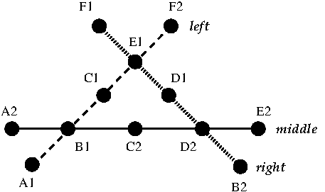

## 1. Introdução

Pretende-se a construção de um sistema de gestão de carreiras de
transporte público.
Para tal, o seu sistema deverá permitir a definição
de estações (paragens) e percursos, assim como a sua consulta.

A interacção com o programa deverá ocorrer através de um conjunto de
linhas compostas por uma letra (comando) e um número de argumentos
dependente do comando a executar.
Pode assumir que todo o *input* fornecido respeitará os tipos indicados,
por exemplo onde é esperado um valor inteiro decimal nunca será
introduzida uma letra.
Os possíveis comandos são listados na tabela seguinte e indicam
as operações a executar.

| Comando | Acção |
|:---:|:---|
| __q__ | termina o programa |
| __c__ | adiciona e lista as carreiras |
| __p__ | adiciona e lista as paragens |
| __l__ | adiciona e lista as ligações entre paragens |
| __i__ | lista os nós de interligação |

## 2. Especificação do problema

O objectivo do projeto é ter um sistema de gestão de carreiras de
transportes públicos.
Para tal são criadas um conjunto de carreiras cujos trajetos correspondem
a uma sequência de ligações entre paragens.



Cada __carreira__ (*left*, *right* ou *middle* na figura)
é caracterizada por um nome composto por letras ou
dígitos decimais, uma paragem de origem e uma paragem de destino.
O comprimento do nome não pode exceder __20__ *bytes*.
Notar que um carater acentuado em *utf-8* utiliza mais de um *byte*.
Por exemplo `praça` tem 5 letras mas ocupa 6 *bytes* (`char` em __C__).

Uma __paragem__ (*A1*, *A2*, *B1*, ... na figura)
é caracterizada por um nome e uma localização, latitude
e longitude, representados como números reais em vírgula flutuante.
No nome que descreve a paragem podem ocorrer carateres brancos
(espaços ou tabulador horizontal `\t`).
Neste caso, o nome é representado entre aspas.
Caso não contenha carateres brancos, o nome pode ser delimitado por aspas
ou não.
O nome nunca contém o carater aspa na sua descrição.
O comprimento do nome não pode exceder __50__ *bytes*.

Cada __ligação__ (*A1* para *B1*, *B1* para *C1*, ... na figura)
é caracterizada por uma __carreira__, duas __paragens__
(origem e destino), um custo e uma duração.
Para ser uma ligação válida esta deve representar uma extensão da carreira,
ou seja a origem da ligação é a mesma paragem que a estação terminal da carreira
ou o destino da ligação é a mesma paragem que a estação de partida da carreira.
O custo e a duração são representados como números reais em vírgula flutuante
e devem ser impressos com duas casas decimais (`%.2f`).

Note que podem existir carreiras circulares. Quando se adiciona uma ligação
com origem na última paragem de uma carreira e com destino na primeira paragem
da carreira, então forma-se um ciclo. Nestas situações, a nova ligação é adicionada
no fim da carreira.

Podem existir no máximo __200__ carreiras, __10000__ paragens e
__30000__ ligações.

## 3. Dados de Entrada

O programa deverá ler os dados de entrada a partir da linha de comandos do
terminal.
Nenhuma linha de comandos excede __BUFSIZ__ *bytes* (*8192 bytes* na maioria
dos sistemas).

Durante a execução do programa as instruções devem ser lidas do terminal
(*standard input*) na forma de um conjunto de linhas iniciadas por um
carácter, que se passa a designar por comando, seguido de um número de
informações dependente do comando a executar; o comando e cada uma das
informações são separados por pelo menos um carácter branco.

Os comandos disponíveis são descritos de seguida. Os caracteres `<` e `>`
são utilizados apenas na descrição dos comandos para indicar os parâmetros.
Os parâmetros opcionais estão indicados entre caracteres `[` e `]`.
As repetições estão indicadas entre caracteres `{` e `}`.
Cada comando tem sempre todos os parâmetros necessários à sua correcta
execução.
Os caracteres `...` indicam possíveis repetições de um parâmetro.

Cada comando indica uma determinada acção que se passa a caracterizar em
termos de formato de entrada, formato de saída e erros a retornar.

<u>Se o comando gerar mais de um erro, deverá ser indicado apenas o primeiro.</u>

- __q__ - termina o programa:
  - Formato de entrada: `q`
  - Formato de saída: NADA

- __c__ - adiciona e lista as carreiras:
  - Formato de entrada: `c [ <nome-da-carreira> [ inverso ] ]`
  - Formato de saída sem argumentos: `<nome-da-carreira> <paragem-origem> <paragem-destino> <número-de-paragens> <custo-total> <duração-total>`, pela ordem de criação. As paragens são omitidas para carreiras sem ligações.
  - Formato de saída com argumentos: `<paragem-origem> { , <paragem> }`, pela sequência do percurso se não for criada uma nova carreira.
  - Nota: o parâmetro `inverso` implica a impressão das paragens por ordem inversa e pode ser abreviado até 3 carateres, caso contrário nada deve ser impresso.
  - Erros:
    - `incorrect sort option.` no caso de depois do nome da carreira existir uma palavra que não seja `inverso` ou uma das suas abreviaturas até 3 caracteres.

- __p__ - adiciona e lista paragems:
  - Formato de entrada: `p [ <nome-de-paragem> [ <latitude> <longitude> ] ]`
  - Formato de saída sem argumentos: `<nome-de-paragem>: <latitude> <longitude> <número-de-carreiras>` por cada paragem e pela ordem de criação, uma por linha onde `<número-de-carreiras>` é o número de carreiras que param na paragem.
  - Formato de saída com um argumento: `<latitude> <longitude>`.
    - Se o comando for invocado com três argumentos, é criada uma nova paragem sem gerar dados na saída.
    - Notas:
      - O `<nome-de-paragem>` deve ser delimitado por aspas se o nome contiver carateres brancos (espaço ou tabulador horizontal); o nome não pode conter o carater aspa.
  - Erros:
    - `<nome-de-paragem>: stop already exists.` no caso da criação de uma paragem e já existir uma paragem com o nome indicado.
    - `<nome-de-paragem>: no such stop.` no caso da listagem de uma paragem e não existir uma paragem com o nome indicado.
    - As coordenadas são impressas em 16 posições com 12 dígitos décimais (`%16.12f`).

- __l__ - adiciona ligações:
  - Formato de entrada: `l <nome-de-carreira> <paragem-origem> <paragem-destino> <custo> <duração>`
  - Formato de saída: NADA
  - Notas:
    - O `<nome-de-paragem>` deve ser delimitado por aspas se o nome contiver carateres brancos (espaço ou tabulador horizontal); o nome não pode conter o carater aspa.
  - Erros:
    - `<nome-de-carreira>: no such line.` no caso de não existir uma carreira com o nome indicado.
    - `<nome-de-paragem>: no such stop.` no caso de não existir uma paragem com o nome indicado, origem ou destino.
    - `link cannot be associated with bus line.` no caso das paragens da ligação, origem ou destino, não correspoderem a um dos extremos da carreira.
    - `negative cost or duration.` no caso do custo ou duração serem valores negativos.

- __i__ - lista as interseções entre as carreiras:
  - Formato de entrada: `i`
  - Formato de saída: `<nome-de-paragem> <número-de-carreiras>: <nome-de-carreira> ...` por cada paragem onde pára mais de uma linha, uma por linha por ordem de criação das paragens. Os nomes das carreiras devem ser listados alfabeticamente.

__Só poderá usar as funções de biblioteca definidas em `stdio.h`,
`stdlib.h`, `ctype.h` e `string.h`__

*Nota importante*: não é permitida a utilização da instrução `goto`, da declaração `extern`,
nem da função `qsort` nativa do C e nenhum destes *nomes* deve aparecer no vosso código.

## Exemplos de utilização dos comandos

Considere que estão definidas as carreiras da figura acima.

### __Comando `c`__

```text
c
```

O comando `c` sem argumentos permite listar todas as carreiras do sistema.

```text
c middle
```

O comando `c` seguido de uma carreira existente no sistema permite listar todas as paragens da carreira desde a origem ao destino.

```text
c middle inverso
```

O mesmo que o anterior, mas as paragens são listadas do destino para a origem.

```text
c down
```

O comando `c` seguido de uma carreira não existente no sistema permite criar a nova carreira. Neste caso não há nada a mostrar no output.

### __Comando `p`__

```text
p
```

O comando `p` sem argumentos permite listar todas as paragens do sistema.

```text
p C1
```

O comando `p` com um argumento mostra a latitude e longitude da paragem.

```text
p X1 2.5 45.6
```

O comando `p` com três argumentos cria uma nova paragem.

### __Comando `l`__

```text
l left X1 A1 0.5 2
```

O comando `l` permite adicionar novas ligações a uma carreira. Neste caso, se `X1` for a última paragem da carreira, então a nova ligação é inserida no fim e `A1` é a nova última paragem. Caso contrário, se `A1` é a origem da carreira, então a ligação é inserida no início da carreira e `X1` passa a ser a nova origem. Se ambas as condições se verificarem (inserção de um ciclo na carreira), então a ligação é inserida no fim.

### Comando __`i`__

```text
i
```

O comando `i` permite listar as paragens que correspondem a interseções de carreiras.

## 4. Compilação e teste

O compilador a utilizar é o `gcc` com as seguintes opções de compilação:
`-O3 -Wall -Wextra -Werror -ansi -pedantic`. Para compilar o programa deve
executar o seguinte comando:

```text
  $ gcc -O3 -Wall -Wextra -Werror -ansi -pedantic -o proj1 *.c
```

O programa deverá escrever no *standard output* as respostas aos comandos
apresentados no *standard input*. As respostas são igualmente linhas de
texto formatadas conforme definido anteriormente neste enunciado.
Tenha em atenção ao número de espaços entre elementos do seu output,
assim como a ausência de espaços no final de cada linha. Procure respeitar
escrupulosamente as indicações dadas.

Ver os exemplos de input e respectivos output na pasta `public-tests/`.

O programa deve ser executado da forma seguinte:

```text
  $ ./proj1 < test.in > test.myout
```

Posteriormente poderá comparar o seu output (`*.myout`) com o output previsto (`*.out`) usando o comando `diff`,

```text
  $ diff test.out test.myout
```

Para testar o seu programa poderá executar os passos indicados acima ou usar o comando `make` na pasta `public-tests/`.

## 5. Entrega do Projeto

Será criado um repositório `git` para cada aluno desenvolver e submeter o projeto. Este repositório será criado no [GitLab da RNL](https://gitlab.rnl.tecnico.ulisboa.pt) e será activado quando da publicação deste enunciado.

Na sua submissão do projeto deve considerar os seguinte pontos:

- Considera-se que os seus ficheiros de desenvolvimento do projeto (`.c` e `.h`) estão na raiz do repositório e não numa directoria. *Qualquer ficheiro fora da raíz não será considerado como pertencendo ao seu projeto*.

- A última versão que estiver no repositório da RNL será considerada a submissão para avaliação do projeto. Qualquer versão anterior ou que não esteja no repositório não será considerada na avaliação.

- Antes de fazer qualquer submissão para o repositório da RNL, não se esqueça que deve sempre fazer `pull` para sincronizar o seu repositório local.

- Quando actualizar os ficheiros `.c` e `.h` na directoria `src` no seu repositório na RNL, esta versão será avaliada e será informado se essa versão apresenta a resposta esperada num conjunto de casos de teste. Tal como no repositório dos laboratórios, o resultado da avaliação automática será colocado no repositório do aluno.

- Para que o sistema de avaliação seja executado, tem que esperar pelo menos 10 minutos. Sempre que fizer uma actualização no repositório, começa um novo período de espera de 10 minutos. Exemplos de casos de teste serão oportunamente fornecidos.

- Data limite de entrega do projeto: __24 de março de 2023, às 19h59m__. Até à data limite poderá efectuar o número de submissões que desejar, sendo utilizada para efeitos de avaliação a última versão. Deverá portanto verificar cuidadosamente que a última versão no repositório GitLab da RNL corresponde à versão do projeto que pretende que seja avaliada. Não existirão excepções a esta regra.

## 6. Avaliação do Projeto

Na avaliação do projeto serão consideradas as seguintes componentes:

1. A primeira componente avalia o desempenho da funcionalidade do programa realizado. Esta componente é avaliada entre 0 e 16 valores.

2. A segunda componente avalia a qualidade do código entregue, nomeadamente os seguintes aspectos: comentários, indentação, estruturação, modularidade, abstracção, entre outros. Esta componente poderá variar entre -4 valores e +4 valores relativamente à classificação calculada no item anterior e será atribuída posteriormente.
Algumas *guidelines* sobre este tópico podem ser encontradas [guidelines.md](https://fenix.tecnico.ulisboa.pt/downloadFile/1970943312391122/guidelines.md).

- A classificação da primeira componente da avaliação do projeto é obtida através da execução automática de um conjunto de testes num computador com o sistema operativo GNU/Linux. Torna-se portanto essencial que o código compile correctamente e que respeite o formato de entrada e saída dos dados descrito anteriormente. Projetos que não obedeçam ao formato indicado no enunciado serão penalizados na avaliação automática, podendo, no limite, ter 0 (zero) valores se falharem todos os testes. Os testes considerados para efeitos de avaliação poderão incluir (ou não) os disponibilizados na página da disciplina, além de um conjunto de testes adicionais. A execução de cada programa em cada teste é limitada na quantidade de memória que pode utilizar, e no tempo total disponível para execução, sendo o tempo limite distinto para cada teste.

- Note-se que o facto de um projeto passar com sucesso o conjunto de testes disponibilizado na página da disciplina não implica que esse projeto esteja totalmente correcto. Apenas indica que passou alguns testes com sucesso, mas este conjunto de testes não é exaustivo. É da responsabilidade dos alunos garantir que o código produzido está correcto.

- Em caso algum será disponibilizado qualquer tipo de informação sobre os casos de teste utilizados pelo sistema de avaliação automática. A totalidade dos ficheiros de teste usados na avaliação do projeto serão disponibilizados na página da disciplina após a data de entrega.

## 7. Dicas para Desenvolvimento do Projeto

Abaixo podem encontrar algumas dicas simples que facilitam o despiste de erros comuns no desenvolvimento do projeto.
Sugerimos que __desenvolvam os vossos projetos de forma incremental e que testem as vossas soluções localmente antes de actualizarem no repositório remoto__.

Sugerimos que sigam os seguintes passos:

1. Desenvolva e corrija o código de forma incremental garantindo que compila sem erros nem *warnings*. Não acumule uma série de erros pois o *debug* é tanto mais complexo quanto a dimensão da base de código a analisar.
Algumas dicas sobre este tópico podem ser encontradas [debugging.md](https://fenix.tecnico.ulisboa.pt/downloadFile/1970943312391120/debugging.md).
2. Garanta que está a ler o *input* e a escrever o *output* correctamente, em particular garanta que as *strings* não ficam com espaços extra, `\n` no final, que a formatação está correcta e de acordo com o que está no enunciado, *etc*.
3. Procure desenvolver os comandos pela ordem apresentada.
4. Teste isoladamente cada comando e verifique que funciona correctamente.
