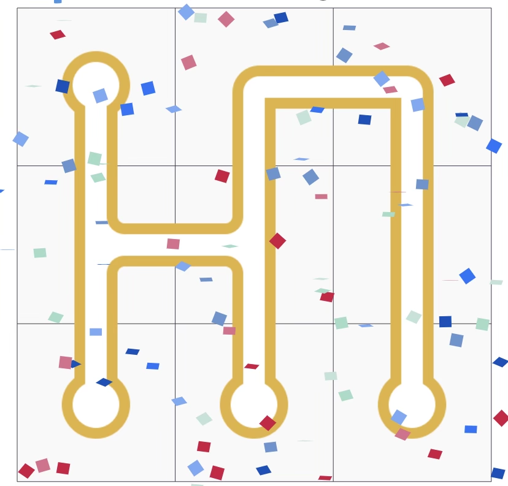

> [!NOTE]
> this is a mirror of [this repository](https://github.com/lucaznch/IArt)

<br>

# Artificial Intelligence Project 2023/2024


## 1. Introduction
The Artificial Intelligence curricular unit project aims to develop a program in Python 3.8 that solves an adaptation of the *Pipe Mania* problem using Artificial Intelligence search and problem-solving techniques.<br>
The game *Pipe Mania* is a puzzle game developed in 1989 by The Assembly Line for the Amiga computer.<br>
It was later adapted for several other platforms by Lucasfilm Games, which gave it the name "Pipe Dream".<br>
The objective of the game is to build a functional plumbing system to prevent water leaks.


## 2 Problem description
The *Pipe Mania* game takes place on a square grid, where each position contains a piece of pipe.<br>
The objective is to rotate the pieces so that they are all connected and the water can circulate without leaks.<br>
[Figure 1a](#figure-1a-initial-state) shows an example of the initial layout of a grid. [Figure 1b](#figura-1b-objectivesolution) shows a solution for this same grid.<br>
**We can assume that an instance of *Pipe Mania* has a unique solution**.<br>

##### Figure 1a: Initial state

<br>

##### Figure 1b: Objective/Solution

<br>


## 3 Objective
The objective of this project is to develop a program in Python 3.8.2 that, given an instance of *Pipe Mani*a, returns the (unique) solution, i.e., all pipes connected and without leaks.
The program must be developed in a `pipe.py` file, which reads an instance of *Pipe Mania* from the standard input in the format described in section [4.1](#41-input-format).
The program must solve the problem using a technique of choice and print the solution to the standard output in the format described in section [4.2](#42-output-format).


## 4 Input and output format
On a *Pipe Mania* board there are 4 ***types of pieces***:
1. Closing pieces (F), with orientation up (C), down (B), left (E) and right (D);
2. Bifurcation pieces (B), with orientation up (C), down (B), left (E) and right (D);
3. Back pieces (V), with orientation up (C), down (B), left (E) and right (D);
4. Connection pieces (L), with horizontal (H) and vertical (V) orientation.

[Figure 2](#figure-2-designations-for-pipe-mania-pieces) contains the designation for each of the pieces that can exist on a board.<br>
As an example, the pieces in the first row of [Figure 1a](#figure-1a-initial-state) correspond to FB / VC / VD, while the pieces in the second row correspond to BC / BB / LV.


##### Figure 2: Designations for *Pipe Mania* pieces
**FC**<br>


**FB**<br>


**FE**<br>


**FD**<br>

<br>
<br>

**BC**<br>


**BB**<br>


**BE**<br>


**BD**<br>

<br>
<br>

**VC**<br>


**VB**<br>


**VE**<br>


**VD**<br>

<br>
<br>

**LH**<br>


**LV**<br>

<br>
<br>

### 4.1 Input format
The instances of the *Pipe Mania* problem follow the following format:
```
<pipe-piece-l1c1> ... <pipe-piece-l1cN>
<pipe-piece-l2c1> ... <pipe-piece-l2cN>
...
<pipe-piece-lNc1> ... <pipe-piece-lNcN>
```

The possible values for `<pipe-piece-*>` are two-letter strings, where the first has as its domain the **piece identification {F,B,V,L}** and the second has as its domain the **piece orientation {C,B,E,D,H,V}**.

##### 4.1.1 Example
The input file that describes the instance of [Figure 1a](#figura-1a-initial-state) is the following:
```
FB VC VD
BC BB LV
FB FB FE
```

<br>


```
FB\tVC\tVD\n
BC\tBB\tLV\n
FB\tFB\tFE\n
```


### 4.2 Output format
The program's output must describe a solution to the *Pipe Mania* problem described in the input file, i.e., a completely filled grid that respects the rules previously stated.
The output must follow the following format:
- One line for each line of the grid.
- Each line indicates the content of the respective grid line.

##### 4.2.1 Example
The output that describes the solution in [Figure 1b](media/) is:

```
FB VB VE
BD BE LV
FC FC FC
```

```
FB\tVB\tVE\n
BD\tBE\tLV\n
FC\tFC\tFC\n
```

## 5 Implementation
This section describes the code that can be used in the project and the code that must be implemented in the project.

### 5.1 Code to use
To carry out this project, Python files must be used, to be made available on the course page, which implement the search algorithms that will be given throughout the academic season.<br>
The most important thing is to understand what they are for and how to use the features implemented in these files.<br>
These files must not be changed. If there is a need to change definitions included in these files, these changes must be made in the developed code file that contains the project implementation.<br>
Other dependencies are not allowed, except the Python package numpy, which can be useful for representing the solution and having access to operations on arrays.
##### 5.1.1 Searches
The `search.py` file contains the necessary structures to run the different search algorithms. The following stand out:
- **Problem Class**: Abstract representation of the search problem;
- **breadth_first_tree_search function**: Breadth-first search;
- **depth_first_tree_search** function: Depth-first search;
- **Greedy_search function**: Greedy search;
- **astar_search function**: A* search.


#### 5.1.2 State Class
This class represents the states used in search algorithms. The board member stores the grid configuration that the state corresponds to.<br>
Below is the code for this class. Changes can be made to this class, such as modifications to the `__lt__(self, other)` method to support more complex tiebreaker functions. However, these changes must be properly justified with comments in the code.

```python
class PipeManiaState:
     state_id = 0
    
     def __init__(self, board):
         self.board = board
         self.id = PipeManiaState.state_id
         PipeManiaState.state_id += 1

     def __lt__(self, other):
         """ This method is used in case of a tie in list management
         open in informed searches. """
         return self.id < other.id
```

### 5.2 Code to implement
#### 5.2.1 Board Class
The Board class is the internal representation of a *Pipe Mania* grid. The implementation of this class and its methods is free.<br>
You can, as an example, include the methods for determining adjacent values `adjacent_vertical_values` and `adjacent_horizontal_values` which receive **two arguments**, the grid coordinates **(row, column)**, and return a **tuple with two strings** that correspond to adjacent values **vertically (above, below) and horizontally (left, right)**, respectively. If there are no adjacent values, i.e. at the edges of the grid, they return **None**.<br>
You can also implement other methods, such as a `get_value` method that returns the value filled in at a given position, or a print method that prints the grid in the format described in section [4.2](#42-output-format). <br>
These methods can be used to test the remaining implementation of the class.


```python
Class Board:
""" Internal representation of a PipeMania grid. """

     def adjacent_vertical_values(self, row: int, col: int) -> (str, str):
         """ Returns the values immediately above and below,
         respectively. """
         # TODO
         pass

     def adjacent_horizontal_values(self, row: int, col: int) -> (str, str):
         """ Returns the values immediately left and right,
         respectively. """
         # TODO
         pass

     # TODO: other methods in the class
```

#### 5.2.2 parse_instance function
The parse_instance function is responsible for reading an instance of the problem in the presented input format (section [4.1](#41-input-format)) and returning an object of type Board that represents it. This function must read the instance from standard input (stdin).

```python
@staticmethod
def parse_instance():
     """Reads the problem instance from standard input (stdin)
     and returns an instance of the Board class.

     For example:
         $ python3 pipe_mania.py < test-01.txt

         > from sys import stdin
         > line = stdin.readline().split()
     """
     # TODO
     pass
```


#### 5.2.3 PipeMania Class
The **PipeMania class *inherits* from the Problem class** defined in the `search.py` file of the base code and must implement the methods necessary for its use.

The `actions()` method takes a **state as an argument** and **returns a list of actions that can be executed from this state**. The `result()` method takes as **arguments a state and an action**, and **returns the result of applying that action to that state**. <br>
>[!TIP]
>In a **first approach**, very simple and not very efficient, you can consider that an action corresponds to a 90° rotation of a certain piece of the grid. In this case, each action can be represented by a tuple with 3 elements (row index, column index, 90° clockwise/anti-clockwise rotation), where the piece in the upper left corner corresponds to the coordinates (0,0). For example, (0, 1, False) represents the action “rotate the piece in row 0 and column 1 anti-clockwise”. Note that other models, possibly more complex, should be more efficient.
<br>

>[!NOTE]
>To support informed searches, namely greedy search and A*, you must develop a heuristic that can guide these searches in the most efficient way possible.
The heuristic corresponds to the implementation of the `h()` method of the PipeMania class. This function takes a **node as an argument**, from which the current state can be accessed in node.state.<br>

Below is a prototype of the PipeMania class that can be used as a basis for its implementation.

```python
class PipeMania(Problem):
     def __init__(self, initial_state: Board, goal_state: Board):
         """ The constructor specifies the initial state. """
         # TODO
         pass

     def actions(self, state: State):
         """ Returns a list of actions that can be performed at
         from the past state as an argument. """
         # TODO
         pass

     def result(self, state: State, action):
         """ Returns the state resulting from executing the 'action' on
         'state' passed as argument. The action to be taken must be a
         of those present in the list obtained by carrying out
         self.actions(state). """
         # TODO
         pass

     def h(self, node: Node):
         """ Heuristic function used for the A* search. """
         # TODO
         pass
```


#### 5.2.4 Examples of use
Below, some examples of the use of the code to be developed are presented, as well as the respective output. These examples can be used to test the implementation.
Consider that the initial-state.txt file is located in the directory "./boards/board-1/" and that it contains the instance described in section [4.1](#41-formato-do-input).

**Example 1:**<br>
```python
# Read the grid in figure 1a:
board = Board.parse_instance()
print(board.adjacent_vertical_values(0, 0))
print(board.adjacent_horizontal_values(0, 0))
print(board.adjacent_vertical_values(1, 1))
print(board.adjacent_horizontal_values(1, 1))
```

**Output:**
```
(None, BC)
(None, VC)
(VC, FB)
(BC, LV)
```
<br>
<br>

**Example 2:**
```python
# Read the grid in figure 1a:
board = Board.parse_instance()
# Create an instance of PipeMania:
problem = PipeMania(board)
# Create a state with the initial configuration:
initial_state = PipeManiaState(board)
# Show value at position (2, 2):
print(initial_state.board.get_value(2, 2))
# Perform the action of rotating the piece 90° clockwise (2, 2)
result_state = problem.result(initial_state, (2, 2, True))
# Show value at position (2, 2):
print(result_state.board.get_value(2, 2))
```

**Output:**
```
FE
FC
```

<br>
<br>

**Example 3:**
```python
# Read the grid in figure 1a:
board = Board.parse_instance()
# Create an instance of PipeMania:
problem = PipeMania(board)
# Create a state with the initial configuration:
s0 = PipeManiaState(board)
# Apply the actions that resolve the instance
s1 = problem.result(s0, (0, 1, True))
s2 = problem.result(s1, (0, 1, True))
s3 = problem.result(s2, (0, 2, True))
s4 = problem.result(s3, (0, 2, True))
s5 = problem.result(s4, (1, 0, True))
s6 = problem.result(s5, (1, 1, True))
s7 = problem.result(s6, (2, 0, False)) # anti-clockwise (example of use)
s8 = problem.result(s7, (2, 0, False)) # anti-clockwise (usage example)
s9 = problem.result(s8, (2, 1, True))
s10 = problem.result(s9, (2, 1, True))
s11 = problem.result(s10, (2, 2, True))
# Check if the solution has been reached
print("Is goal?", problem.goal_test(s5))
print("Is goal?", problem.goal_test(s11))
print("Solution:\n", s11.board.print(), sep="")
```

**Output:**
```
Is goal? False
Is goal? True
Solution:
FB VB VE
BD BE LV
FC FC FC
```

<br>
<br>

**Example 4:**
```python
# Read the grid in figure 1a:
board = Board.parse_instance()
# Create an instance of PipeMania:
problem = PipeMania(board)
# Get the solution node using depth-first search:
goal_node = depth_first_tree_search(problem)
# Check if the solution has been reached
print("Is goal?", problem.goal_test(goal_node.state))
print("Solution:\n", goal_node.state.board.print(), sep="")
```

**Output:**
```
Is goal? True
Solution:
FB VB VE
BD BE LV
FC FC FC
```
<br>
<br>
The return value of the search functions is an object of type Node. Various information can be retrieved from the return node, for example, the final state (goal_node.state), the action that led to the final state goal_node.action, and the preceding node goal_node.parent.