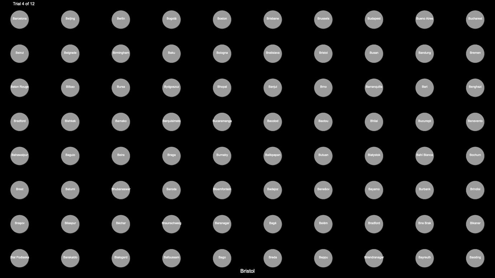

> [!NOTE]
> this is a mirror of [this repository](https://github.com/jorgeflmendes/Grupo-3-IPM)

# Human-Computer Interaction Project - Target Selection in Dense Interfaces - BACK-OFF 2 - Grupo 03
### Challenge: reduce choice and selection time in a dense interface - average time per target with penalty ~ 2s

## 1. Challenge
### The objective of the project is to reduce target selection time in a dense interface (80 targets). A base code is available that:
1. Shows a **grid of 8x10 targets** to your users;
2. Identifies each target in the grid with a **label** that is randomly associated at the beginning of the program execution;
3. Indicates which **target to select**;
4. **Quantifies user performance** based on success rate (accuracy, 0-100%), total task time (seconds), average time per target (seconds), and average time per target with penalty (seconds) if the your user success rate is not 100%;
5. **Save performance metrics** on the Firebase platform.

It is necessary to change the base code provided so that users select targets as quickly as possible (be aware of the penalty for selection errors).

## 2. Operation and Rules
### The project is an open-ended drawing challenge. It is crucial that they begin an iterative process of generating and testing ideas from day one. Your solution must comply with the following rules:

1. You cannot assume knowledge about the target to be selected nor access the variable with this label. However, they can assume knowledge about targets that have already been requested and selected.
2. You may not modify the source code that calculates the performance metrics described in 1.4, nor the code relating to Firebase in 1.5;
3. You cannot manipulate the area or content with the target caption to be selected at the bottom of the screen;
4. You cannot require the use of additional hardware for input other than a conventional mouse with two buttons, and additional hardware for output other than headphones;
5. Text input is not permitted, whether via a physical or virtual keyboard;
6. You cannot change the “subtitles.csv” document;7. You must ensure that all elements of your UI (targets, etc.) are the same size on any screen. To do this, look carefully at the windowResized() method where we calculate the pixels-per-inch (PPI) and pixels-per cm (PPCM) of your users' screen

## 3. Our implementation
In the current directory, you will find the base code.
However, we made 4 interfaces while looking for the most efficient one.
- we have [this](grouped-by-columns/sketch.js) interface, where it is grouped by **columns**
- we have [this](grouped-by-rows/sketch.js) interface, where it is grouped by **rows**
- we have [this](grouped-by-menus-preffix/sketch.js) interface, where it is grouped by **menus**, organized by **preffix**
- we have [this](grouped-by-menus-suffix/sketch.js) interface, where it is grouped by **menus**, organized by **suffix**

### the interface we chose was the one grouped by menus, organized by the suffix!

> [!NOTE]
> We are using the JavaScript p5.js library!
