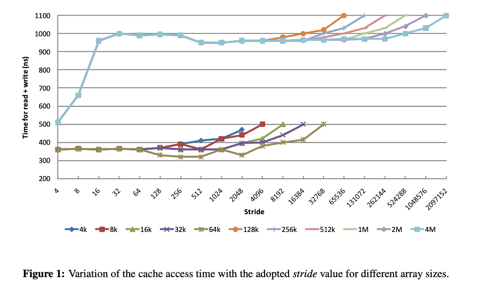
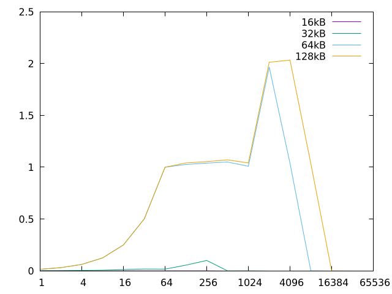
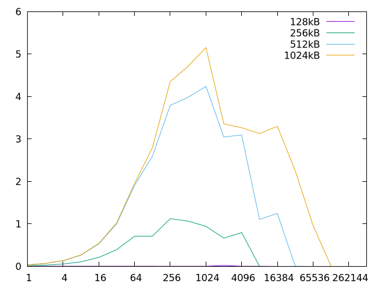

# Cache profiling
check the [pdf]() for the assignment description

## Exercise

1. What is the cache capacity of the computer you used (please write the workstation name)?
- cluster, lab6p2, **i5 8500 3.00GHz (Hexa-core)**
    ```yaml
    lscpu:
    - {cache: L1d}     192 KiB (6 instances)
    - {cache: L1i}     192 KiB (6 instances)
    - {cache: L2}      1.5 MiB (6 instances)
    - {cache: L3}      9 MiB (1 instance)
    ```

    ```yaml
    getconf -a | grep CACHE:
    - LEVEL1_ICACHE_SIZE                 32768
    - LEVEL1_ICACHE_ASSOC                
    - LEVEL1_ICACHE_LINESIZE             64

    - LEVEL1_DCACHE_SIZE                 32768
    - LEVEL1_DCACHE_ASSOC                8
    - LEVEL1_DCACHE_LINESIZE             64

    - LEVEL2_CACHE_SIZE                  262144
    - LEVEL2_CACHE_ASSOC                 4
    - LEVEL2_CACHE_LINESIZE              64

    - LEVEL3_CACHE_SIZE                  9437184
    - LEVEL3_CACHE_ASSOC                 12
    - LEVEL3_CACHE_LINESIZE              64
    ```

    - 1 instance:
        - `L1d` = `L1i` = 192/6 KiB = **32 Kib**
        - `L1` = **64 KiB**
        - `L2` = $\frac{(1.5 \times 2^20)}{6} \ \text{Bytes} = 262144 \ \text{Bytes} = 256 \times 2^{10} \ \text{Bytes}$ =  **256 KiB**
        - `L3` = **9 MiB**


array size (KiB) | elapsed time (s) | number of accesses a[i] | mean access time
-----------------|------------------|-------------------------|-------------------
8		         | 0.001778     	|                         |
16		         | 0.003616	        |                         |
32		         | 0.007338	        |                         |
64		         | 0.012161	        |                         |
128		         | 0.024445	        |                         |
256		         | 0.052076	        |                         |


<br>
<br>



Consider the data presented in Figure 1. Answer the following questions (2, 3, 4) about the machine used to generate that data.

<br>
<br>

2. **What is the cache capacity?**
    - figura 1 temos dois grupos de array sizes que se distinguem pelos tempos de acesso à cache.
        - grupo 1:
            - sizes: [4K, 64K]
            - $\text{tempo de acesso}_{0} \simeq$ **350 ns**
        - grupo 2:
            - sizes: [128K, 4M]
            - $\text{tempo de acesso}_{0} \simeq$ **500 ns**
    - os tempos de acesso do grupo 2 são significativamente maiores.
    - grupo 2 tem mais misses
    - inferimos que o grupo 1 corresponde a array sizes iguais ou menores à capacidade da cache
    - então a capacidade da cache corresponde ao maior array size do grupo: **64 KiB**

<br>

3. **What is the size of each cache block?**
    - vendo os tempos de acesso do grupo 2, que são os mais penalizados, reparamos que com **stride = 16** os tempos de acesso começam a estabilizar
    - o tempo de acesso estabiliza quando o stride é igual ou maior ao cache block size, dado que cada elemento do array corresponde a um bloco diferente resultando num miss rate de aproximadamente 100% que será igual para todos os strides seguintes
    
    - exemplo:
        - stride = 16 && sendo cada elemento 2 bytes (`int16_t`):
            - acesso 1: a[0]: miss -> copiar a[0]- a[15]
            - acesso 2: a[16]: miss -> copiar a[16]- a[31]
            - ...
                - copiar 16 elementos => 16 $\times$ 2 B = 32 Bytes

    - logo, o cache block size é igual a **32 Bytes**

> [!NOTE]
> **stride** - states how many entries are being skipped at each access; for example, if the stride is 4, entries 0, 4, 8, 12, ... in the array are being accessed, while entries 1, 2, 3, 5, 6, 7, 9, 10, 11, ... are skipped;

<br>

4. **What is the L1 cache miss penalty time?**
    - comparamos o tempo de acesso quando o miss rate é aproximadamente 0% com o tempo de acesso quando o miss rate é aproximadamente 100%
        - miss rate $\simeq$ 0% $\to$ grupo 1
            - para array sizes menores que o cache size com stride $\leqslant$ cache block size = 16
            - tempo de acesso $\simeq$ 350 ns

        - miss rate $\simeq$ 100% $\to$ grupo 2
            - para array sizes maiores que o cache size com stride $\geqslant$ cache block size = 16
            - tempo de acesso $\simeq$ 1000 ns

    - logo, miss penalty = $1000 - 350 = 650$ ns

<br>
<br>
<br>

## 3 Procedure
### 3.1 Modeling Computer Caches
The goal is to model the characteristics of the L1 data cache and L2 cache of the targeted computer platform.

#### 3.1.1 Modeling the L1 Data Cache

- **a)** What are the processor events that will be analyzed during its execution? Explain their meaning.
    - o evento analisado no programa `cm1.c` é o **PAPI_L1_DCM** = "L1 Data Cache Misses"
    - vamos analisar quantos misses ocorrem durante a execução do programa

<br>

- **b)** Plot the variation of the average number of misses (Avg Misses) with the stride size, for each considered dimension of the L1 data cache (8kB, 16kB, 32kB and 64kB). Note that, you may fill these tables and graphics (as well as the following ones in this report) on your computer and submit the printed version.


    

    - tables with the data: [data](report-tables-3-1-1.md)

<br>

- **c)** By analyzing the obtained results:
    - **Determine the size of the L1 data cache**. Justify your answer.
        - temos dois grupos de array sizes que se distinguem pelos avg. misses
            - grupo 1:
                - sizes: {16KB, 32KB}
                - $\text{avg miss rate} \simeq$ **0**
            - grupo 2:
                - sizes: {64KB, 128KB}
                - $\text{avg miss rate} \simeq$ **1**
        - o grupo 2 tem significativamente mais misses
        - o grupo 1 corresponde a array sizes iguais ou menores à capacidade da cache
        - então a capacidade da cache corresponde ao maior array size do grupo 1: **32 KiB**

    <br>

    - **Determine the block size adopted in this cache**. Justify your answer.
        - vendo os avg. misses do grupo 2, que são os mais penalizados, reparamos que com **stride = 64** os avg. misses começam a estabilizar
        - os avg. misses estabilizam quando o stride é igual ou maior ao cache block size, dado que cada elemento do array corresponde a um bloco diferente resultando num miss rate de aproximadamente 100% que será igual para todos os strides seguintes
        - logo, o cache block size é igual a **64 Bytes**

    <br>

    - **Characterize the associativity set size adopted in this cache**. Justify your answer.
        - associativity = 8
        - TODO


<br>
<br>

#### 3.1.2 Modeling the L2 Cache

- **a)** Describe and justify the changes introduced in this program.
    - como estamos a modelar a cache L2 precisamos de analisar quantos L2 misses ocorrem durante a execução do programa
        - logo `PAPI_L1_DCM` $\leadsto$ `PAPI_L2_DCM`
    - como o tamanho da L2 é superior ao da L1
        ```c
        #define CACHE_MIN (128 * 1024)      // 128 KiB
        #define CACHE_MAX (1024 * 1024)     // 1 MiB
        ```

<br>

- **b)** Plot the variation of the average number of misses (Avg Misses) with the stride size, for each considered dimension of the L2 cache.

    

<br>

- **c)** By analyzing the obtained results:
    - **Determine the size of the L2 data cache**. Justify your answer.
        - temos dois grupos de array sizes que se distinguem pelos avg. misses
            - grupo 1:
                - sizes: {128KB, 256KB}
                - $\text{avg miss rate} \simeq$ **0,1**
            - grupo 2:
                - sizes: {512KB, 1024KB}
                - $\text{avg miss rate} \simeq$ **1,5**
        - o grupo 2 tem significativamente mais misses
        - o grupo 1 corresponde a array sizes iguais ou menores à capacidade da cache
        - então a capacidade da cache corresponde ao maior array size do grupo 1: **256 KiB**

    <br>

    - **Determine the block size adopted in this cache**. Justify your answer.
        - TODO
        - cache block size = 64


    <br>

    - **Characterize the associativity set size adopted in this cache**. Justify your answer.
        - TODO
        - associativity = 8

<br>
<br>


### 3.2 Profiling and Optimizing Data Cache Accesses

#### 3.2.1 Straightforward implementation

- **a)** What is the total amount of memory that is required to accommodate each of these matrices?

    ```c
    #define N 512

    int16_t mul1[N][N];
    int16_t mul2[N][N];
    int16_t res[N][N];
    ```

    - sendo que um elemento da matriz corresponde a 2 bytes, então:
        - `N_size` = $2 \times 512 = 1024 \ \text{Bytes}$
        - **matrix size** = `N_size` $\times$ `N_size` = $1024^2 \ \text{Bytes}$ = **1 MiB**

<br>

- **b)** Fill the following table with the obtained data.
    - `mm1.c` output:

        ```yaml
        After resetting counter 'PAPI_L1_DCM' [x10^6]: 0.000000
        After resetting counter 'PAPI_LD_INS' [x10^6]: 0.000000
        After resetting counter 'PAPI_SR_INS' [x10^6]: 0.000000
        After stopping counter 'PAPI_L1_DCM'  [x10^6]: 135.171747
        After stopping counter 'PAPI_LD_INS'  [x10^6]: 402.654038
        After stopping counter 'PAPI_SR_INS'  [x10^6]: 134.218057
        Wall clock cycles [x10^6]: 586.932123
        Wall clock time [seconds]: 0.195646
        Matrix checksum: 2717908992
        ```

    - **Total number of L1 data cache misses**:
        - `PAPI_L1_DCM` = $135.171747 \times 10^6$

    - **Total number of load / store instructions completed**:
        - `PAPI_LD_INS` + `PAPI_SR_INS` = $536.872095 \times 10^6$

    - **Total number of clock cycles**: $586.932123 \times 10^6$
    
    - **Elapsed time**: 0.195646 seconds

<br>

- **c)** Evaluate the resulting L1 data cache Hit-Rate:
    - **hit rate** = 1 - **miss rate**
    - **miss rate** = $\frac{\text{misses}}{\text{total accesses}} = \frac{\text{PAPI-L1-DCM}}{\text{PAPI-LD-INS + PAPI-SR-INS}}$

    - logo, **hit rate** = $\frac{135.171747 \times 10^6}{536.872095 \times 10^6} = 0.7482235559$

<br>
<br>

#### 3.2.2 First Optimization: Matrix transpose before multiplication [2]

```c
#define N 512

int16_t mul1[N][N];
int16_t mul2[N][N];
int16_t res[N][N];
int16_t temp[N][N];     // extra array
```

- **a)** Fill the following table with the obtained data.
    - `mm2.c` output:

        ```yaml
        After resetting counter 'PAPI_L1_DCM' [x10^6]: 0.000000
        After resetting counter 'PAPI_LD_INS' [x10^6]: 0.000000
        After resetting counter 'PAPI_SR_INS' [x10^6]: 0.000000
        After stopping counter 'PAPI_L1_DCM'  [x10^6]: 4.215540
        After stopping counter 'PAPI_LD_INS'  [x10^6]: 402.654019
        After stopping counter 'PAPI_SR_INS'  [x10^6]: 134.218057
        Wall clock cycles [x10^6]: 538.888020
        Wall clock time [seconds]: 0.179631
        Matrix checksum: 2717908992
        ```
    - **Total number of L1 data cache misses**:
        - `PAPI_L1_DCM` = $4.215540 \times 10^6$

    - **Total number of load / store instructions completed**:
        - `PAPI_LD_INS` + `PAPI_SR_INS` = $536.872076 \times 10^6$

    - **Total number of clock cycles**: $538.888020 \times 10^6$
    
    - **Elapsed time**: 0.179631 seconds

<br>

- **b)** Evaluate the resulting L1 data cache Hit-Rate:
    - **hit rate** = 1 - **miss rate**
    - **miss rate** = $\frac{\text{misses}}{\text{total accesses}} = \frac{\text{PAPI-L1-DCM}}{\text{PAPI-LD-INS + PAPI-SR-INS}}$

    - logo, **hit rate** = $\frac{4.215540 \times 10^6}{536.872076 \times 10^6} = 0.9921479619$

<br>

- **c)**  Change the code in the program `mm2.c` in order to include the matrix transposition in the execution time. Fill the following table with the obtained data.
    - `mm2-v2.c` output:

        ```yaml
        After resetting counter 'PAPI_L1_DCM' [x10^6]: 0.000000
        After resetting counter 'PAPI_LD_INS' [x10^6]: 0.000000
        After resetting counter 'PAPI_SR_INS' [x10^6]: 0.000000
        After stopping counter 'PAPI_L1_DCM'  [x10^6]: 4.481076
        After stopping counter 'PAPI_LD_INS'  [x10^6]: 402.916291
        After stopping counter 'PAPI_SR_INS'  [x10^6]: 134.480202
        Wall clock cycles [x10^6]: 539.357284
        Wall clock time [seconds]: 0.179789
        Matrix checksum: 2717908992
        ```

    - **Total number of L1 data cache misses**:
        - `PAPI_L1_DCM` = $4.481076 \times 10^6$

    - **Total number of load / store instructions completed**:
        - `PAPI_LD_INS` + `PAPI_SR_INS` = $537.396493 \times 10^6$

    - **Total number of clock cycles**: $539.357284 \times 10^6$
    
    - **Elapsed time**: 0.179789 seconds

    - Comment on the obtained results when including the matrix transposition in the execution time.
        - não há grande diferença em termos de tempo de execução e verifica-se com os resultados obtidos, pois o processo intensivo é a multiplicação de matrizes que é $O(N^3)$ enquanto a transposição da matriz é $O(N^2)$

- **d)** Compare the obtained results with those that were obtained for the straightforward implementation, by calculating the difference of the resulting hit-rates ($\Delta\text{Hit Rate}$) and the obtained speedups. 

    - **mm1 vs mm2**

    - $\Delta\text{Hit Rate}$ = $\text{Hit Rate}_2 - \text{Hit Rate}_1$
        - $\Delta\text{Hit Rate} = 0.9921479619 - 0.7482235559 = 0.243924406 \leadsto$ 24% 

    - **speedup(number of clocks)**
        - speedup(number of clocks) = $\frac{\text{number of cloks}_1}{\text{number of cloks}_2} = \frac{586.932123 \times 10^6}{538.888020 \times 10^6} = 1.089154149$
            - $\text{number clocks}_2 = 1.089154149 \times \text{number clocks}_1$

    - **speedup(time)**
        - speedup(time) = $\frac{\text{time}_1}{\text{time}_2} = \frac{0.195646}{0.179631} = 1.08915499$
            - $\text{number clocks}_2 = 1.08915499 \times \text{number clocks}_1$

    - comment:
        - foi obtido um speedup muito pequeno em comparação com a implementação original, mesmo que o hit rate aumentou significativamente para mais de 24%
        - esta otimização pode não ser a melhor visto que o speedup foi pequeno e que a otimização implica mais gastos de memória pois tem mais uma matriz NxN

<br>
<br>

#### 3.2.3 Second Optimization: Blocked (tiled) matrix multiply [2]

```c
#define N 512

int16_t mul1[N][N] __attribute__((aligned(CACHE_LINE_SIZE)));
int16_t mul2[N][N] __attribute__((aligned(CACHE_LINE_SIZE)));
int16_t res[N][N] __attribute__((aligned(CACHE_LINE_SIZE)));
```

- **a)** How many matrix elements can be accommodated in each cache line?
    - dados da cache L1
        - **size**: 32 KiB
        - **block size**: 64 B
        - **associativiy**: 8
    - dados do programa:
        - N = 512
        - N_size = 512 $\times$ 2 Bytes = 1024 Bytes
        - **1 elemento da matriz** = 2 Bytes
        - tamanho matriz = 1024 $\times$ 1024 = 1 MiB
    - logo, se uma linha tem 8 blocos de 64 Bytes, conseguimos ter $8 \times 64 = 512$ Bytes
        - então numa linha da cache podemos ter 512 Bytes que corresponde a $\frac{512}{2} = 256$ elementos!

<br>

- **b)** Fill the following table with the obtained data.
    - `mm3.c` output:

        ```yaml
        After resetting counter 'PAPI_L1_DCM' [x10^6]: 0.000000
        After resetting counter 'PAPI_LD_INS' [x10^6]: 0.000000
        After resetting counter 'PAPI_SR_INS' [x10^6]: 0.000000
        After stopping counter 'PAPI_L1_DCM'  [x10^6]: 3.079920
        After stopping counter 'PAPI_LD_INS'  [x10^6]: 403.317493
        After stopping counter 'PAPI_SR_INS'  [x10^6]: 134.627678
        Wall clock cycles [x10^6]: 240.897716
        Wall clock time [seconds]: 0.080299
        Matrix checksum: 2717908992
        ```
    - **Total number of L1 data cache misses**:
        - `PAPI_L1_DCM` = $3.079920 \times 10^6$

    - **Total number of load / store instructions completed**:
        - `PAPI_LD_INS` + `PAPI_SR_INS` = $537.945171 \times 10^6$

    - **Total number of clock cycles**: $240.897716 \times 10^6$
    
    - **Elapsed time**: 0.080299 seconds

<br>

- **c)** Evaluate the resulting L1 data cache Hit-Rate:
    - **hit rate** = 1 - **miss rate**
    - **miss rate** = $\frac{\text{misses}}{\text{total accesses}} = \frac{\text{PAPI-L1-DCM}}{\text{PAPI-LD-INS + PAPI-SR-INS}}$

    - logo, **hit rate** = $\frac{3.079920 \times 10^6}{537.945171 \times 10^6} = 0.9942746582$

<br>

- **d)** Compare the obtained results with those that were obtained for the straightforward implementation, by calculating the difference of the resulting hit-rates ($\Delta\text{Hit Rate}$) and the obtained speedup.

    - **mm1 vs mm3**

    - $\Delta\text{Hit Rate}$ = $\text{Hit Rate}_3 - \text{Hit Rate}_1$
        - $\Delta\text{Hit Rate} = 0.9942746582 - 0.7482235559 = 0.2460511023 \leadsto$ 24% 

    - **speedup(number of clocks)**
        - speedup(number of clocks) = $\frac{\text{number of cloks}_1}{\text{number of cloks}_3} = \frac{586.932123 \times 10^6}{240.897716 \times 10^6} = 2.43643706$
            - $\text{number clocks}_3 = 2.43643706 \times \text{number clocks}_1$

    - **speedup(time)**
        - speedup(time) = $\frac{\text{time}_1}{\text{time}_3} = \frac{0.195646}{0.080299} = 2.436468698$
            - $\text{number clocks}_3 = 2.436468698 \times \text{number clocks}_1$
    
    - comment:
        - foi obtido um speedup melhor em relação ao de mm2 com mm1

<br>

- **e)** Compare the obtained results with those that were obtained for the matrix transpose implementation by calculating the difference of the resulting hit-rates ($\Delta\text{Hit Rate}$) and the obtained speedup. If the obtained speedup is positive, but the difference of the resulting hit-rates is negative, how do you explain the performance improvement? (Hint: study the hit-rates of the L2 cache for both implementations;)

    - **mm2 vs mm3**

    - $\Delta\text{Hit Rate}$ = $\text{Hit Rate}_3 - \text{Hit Rate}_2$
        - $\Delta\text{Hit Rate} = 0.9942746582 - 0.9921479619 = 0.0021266963 \leadsto$ 24% 

    - **speedup(number of clocks)**
        - speedup(number of clocks) = $\frac{\text{number of cloks}_2}{\text{number of cloks}_3} = \frac{538.888020 \times 10^6}{240.897716 \times 10^6} = 2.236999291$
            - $\text{number clocks}_3 = 2.236999291 \times \text{number clocks}_2$

<br>
<br>

#### 3.2.3 (II) Comparing results against the CPU specifications
Now that you have characterized the cache on your lab computer, you are going to compare it against the manufacturer’s specification. For this you can check the device’s datasheet, or make use of the command `lscpu`. Comment the results.

```yaml
lscpu:
- {cache: L1d}     192 KiB (6 instances)
- {cache: L1i}     192 KiB (6 instances)
- {cache: L2}      1.5 MiB (6 instances)
- {cache: L3}      9 MiB (1 instance)
```

- correto exceto para associatividade da L2 (deu 8, e o verdadeiro é 4) 

