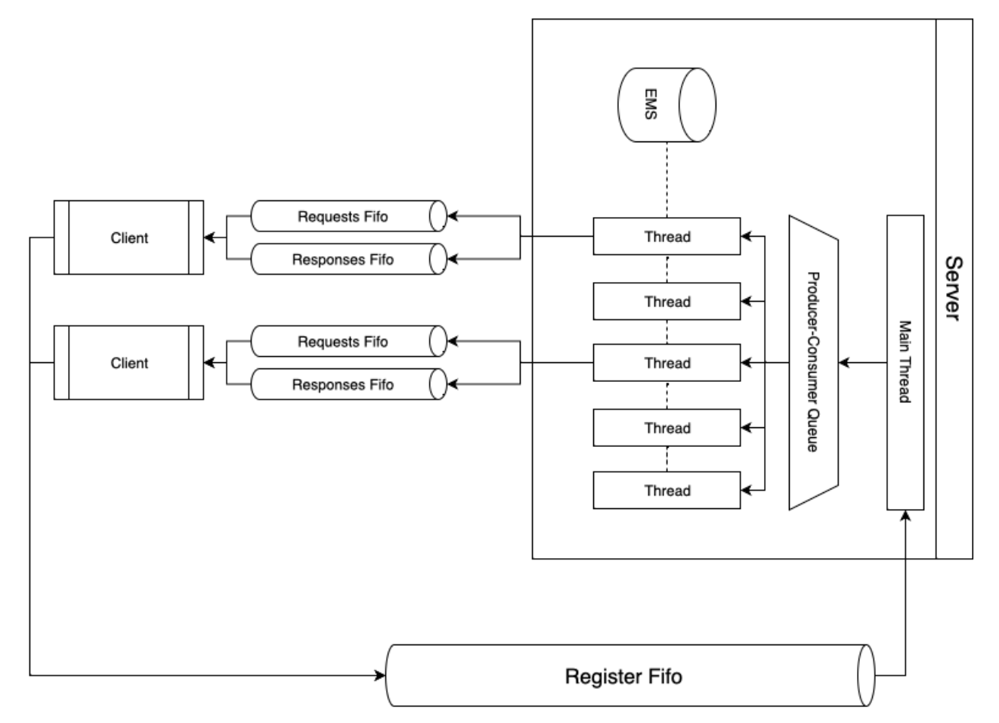

> [!NOTE]
> this is a mirror of [this repository](https://github.com/lucaznch/SO)

<br>
<br>

# IST "Event Management System" (IST-EMS)

### The objective of this project is to develop IST-EMS, an event management system that allows the creation, booking and checking of availability of tickets for events, such as concerts and theater shows.

IST-EMS explores parallelization techniques based on multiple processes and multiple tasks in order to speed up order processing.

When developing IST-SEM, students will also learn how to implement scalable synchronization mechanisms between tasks as well as communication mechanisms between processes (FIFOs and signals).

IST-EMS will also interact with the file system therefore offering the possibility of learning to use POSIX file system programming interfaces.

**Base code**

1. `CREATE <event_id> <num_rows> <num_columns>`
 * This command is used to create a new event with a room where 'event_id' is a unique identifier for the event, 'num_rows' the number of rows and 'num_columns' the number of columns in the room.
 * This event is represented through a matrix in which each position encodes the state of the place:
 * **0 indicates empty space;**
 * **res_id > 0 indicates reserved seat with the reservation identifier res_id.**
 * Usage syntax: **CREATE 1 10 20**
 *Creates an event with identifier 1 with a room of 10 rows and 20 columns.

2. `RESERVE <event_id> [(<x1>,<y1>) (<x2>,<y2>) ...]`
 * Allows you to reserve one or more seats in an existing event room.
 ‘event_id’ identifies the event and each pair of coordinates (x,y) specifies a place to reserve.
 * Each reservation is identified by a strictly positive integer identifier **(res_id > 0)**.
 * Usage syntax: **RESERVE 1 [(1,1) (1,2) (1,3)]**
 * Reserve places (1,1), (1,2), (1,3) in event 1.

3. `SHOW <event_id>`
 * Prints the current status of all places in an event.
 Available seats are marked with ‘0’ and reserved seats are marked with the identifier of the reservation that reserved them.
 * Usage syntax: **SHOW 1**
 * Displays the current status of seats for event 1.

4. `LIST`
 * This command lists all events created by its identifier.
 * Usage syntax: **LIST**

5. `WAIT <delay_ms> [thread_id]`
 * Introduces a delay in command execution, useful for testing system behavior under load conditions.
 * The [thread_id] parameter is only introduced in exercise 3, and until then, this must add a delay to the only existing task.
 * Usage syntax: **WAIT 2000**
 * Adds a delay for the next command by 2000 milliseconds (2 seconds).

6. `BARRIER`
 * Only applicable from exercise 3 onwards, however, the command parsing already exists in the base code.

7. `HELP`
 * Provides information about available commands and how to use them.


Comments on Input:
Lines starting with the character ‘**#**’ are considered comments and are ignored by the command processor (useful for testing).
 * Example: ‘# This is a comment and will be ignored’.


# PART 1
The first part of the project consists of 3 exercises.

## Exercise 1. Interaction with the file system

The base code receives requests only through the terminal (std-input).

In this exercise, the aim is to change the base code so that it starts processing batch requests obtained from files.

For this purpose, IST-EMS must receive as an argument on the command line the path to a “JOBS” directory, where the command files are stored.

IST-EMS must obtain the list of files with the “.jobs” extension contained in the “JOB” directory.

These files contain sequences of commands that respect the same syntax accepted by the base code.

IST-EMS processes all commands in each of the “.jobs” files, creating a corresponding output file with the same name and “.out” extension that reports the status of each event.

File access and manipulation should be done through the POSIX interface based on file descriptors, and not using the stdio.h library and the FILE stream abstraction.


Example output from the /jobs/test.jobs test file:
```
1 0 2
0 1 0
0 0 0
```


## Exercise 2. Parallelization using multiple processes

After completing Exercise 1, students must extend the code created so that each “.job” file is processed by a child process in parallel.

The program must guarantee that the maximum number of active child processes in parallel is limited by a constant, MAX_PROC, which must be passed through the command line when starting the program.

To guarantee the correctness of this solution, the “.jobs” files must contain requests relating to different events, that is, two “.jobs” files cannot contain requests relating to the same event.

Students, for simplicity, do not need to guarantee or verify that this condition is respected (they can assume that it will always be respected in tests carried out during the assessment phase).

The parent process must wait for the completion of each child process and print the corresponding termination state via std-output.


## Exercise 3. Parallelization using multiple tasks

In this exercise we intend to take advantage of the possibility of parallelizing the processing of each .job file using multiple tasks.

The number of tasks to be used to process each “.job” file, **MAX_THREADS**, must be specified by command line at program startup.

Synchronization solutions will be valued in accessing the state of events that maximize the degree of parallelism attainable by the system.

However, the synchronization solution developed must guarantee that any operation is performed in an “atomic” manner (i.e., “all or nothing”).

For example, it should be avoided that, when executing a “SHOW” operation for an event, partially fulfilled reservations may be observed, i.e. reservations for which only a subset of all intended seats have been allocated.


It is also intended to **_extend_** the set of commands accepted by the system with these two additional commands:

* **WAIT <delay_ms> [thread_id]**
 * This command injects a wait of the duration specified by the first parameter into all tasks before processing the next command, if the optional thread_id parameter is not used. If this parameter is used, the delay is only injected into the task with identifier “thread_id”.

 Examples of use:
 * **WAIT 2000**
 * All tasks must wait 2 seconds before executing the next command.
 * **WAIT 3000 5**
 * The task with thread_id = 5, that is, the 5th task to be activated, waits 3 seconds before executing the next command.

* **BARRIER**

 Forces all tasks to wait for commands prior to **BARRIER** to complete before resuming execution of subsequent commands.

 To implement this functionality, tasks, when encountering the **BARRIER** command, must return from the function executed by pthread_create, returning an ad hoc return value (e.g., the value 1) in order to indicate that they found the **BARRIER command ** and that they have not finished processing the command file (in this case the tasks should return a different return value, e.g., 0).

 The main task, that is, the task that starts the “worker” tasks using pthread_create(), must observe the return value returned by the worker tasks using pthread_join and, if it detects that the **BARRIER** command was found, it starts a new round parallel processing that must resume after the **BARRIER** command.

 Examples of use:
 * **BARRIER**
 * All tasks must reach this point before proceeding with their next commands.


This exercise should ideally be carried out using the code obtained after solving exercise 2.

In this case, the attainable degree of parallelism will be **MAX_PROC * MAX_THREADS**.

However, no penalties will be applied if the solution to this exercise is carried out based on the solution to exercise 1.


# PART 2

The second part of the project consists of 2 exercises that aim to:
1. **make IST-EMS accessible to client processes through named pipes**,
2. **allow interaction with IST-EMS through signals**.


### Base code
The base code provided provides a server implementation that corresponds to a possible solution of the first part of the project, without all the code related to reading files (it was moved to the client) and creating threads and processes (it especially contains the logic of synchronization between tasks, mostly in the operations.c file).

It also contains an empty client API implementation, and a client that receives the path to a .jobs file, which calls the API for each of the commands in the file.

The commands used in this part of the project are the same as in the first part, with the exception of BARRIER, which no longer exists in this delivery, and WAIT, which no longer receives the thread_id argument, and is executed on the client side.


## Exercise 1. Interaction with client processes using named pipes
IST-EMS must become an autonomous server process, launched as follows:
`ems pipe_name`

When starting, the server must create a named pipe whose name (pathname) is as indicated in the argument above.

It is through this pipe that client processes will be able to connect to the server and send login requests.


Any client process can connect to the server's pipe and send it a message requesting to start a session.

This request contains the names of two named pipes, which the client previously created for the new session.

It is through these named pipes that the client will send future requests to the server and receive the corresponding responses from the server within the scope of the new session.

Upon receiving a session request, the server assigns a unique identifier to the session, called session_id, and associates the names of the named pipes that the client indicated with this session_id.

It then responds to the client with the session_id of the new session.


The server accepts a maximum of S sessions simultaneously, each with a different session_id, where session_id is a value between [0, S - 1], where S is a constant defined in the server code.

This implies that the server, when it receives a new login request and has S active sessions, must block, waiting for a session to end so that it can create a new one.

A session lasts until **1.** the client sends an end of session message or **2.** the server detects that the client is unavailable.

In the following subsections we describe the IST-EMS client API in greater detail, as well as the content of the request and response messages exchanged between clients and server.

### IST-EMS client API
To allow client processes to interact with IST-EMS, there is a programming interface (API), in C, which we call IST-EMS client API.

This API allows the client to have programs that establish a session with a server and, during that session, invoke operations to access and modify the state of events managed by IST-EMS.

Below we present this API.


The following operations allow the client to establish and end a session with the server:
* __int ems_setup (char const *req_pipe_path, char const *resp_pipe_path, char const *server_pipe_path)__
 * Establishes a session using the named pipes indicated in argument. The named pipes used to exchange requests and responses (i.e. after session establishment) must be created (by calling mkfifo) using the names passed in the 1st and 2nd arguments.
 The server's named pipe must already be previously created by the server, and the corresponding name is passed in the 3rd argument.
 If successful, the session_id associated with the new session will have been stored in a client variable that indicates which session the client currently has active; additionally, all pipes will have been opened by the client.
 Returns 0 on success, 1 on error.

* **int ems_quit()**
 * Ends an active session, identified in the respective client variable, closing the named pipes that the client had open when the session was established and deleting the client named pipe. Returns 0 on success, 1 on error.


Having an active session, the client can invoke the following operations on the server, whose specification is identical to that of the server's homonymous operations:
* **int ems_create(unsigned int event_id, size_t num_rows, size_t num_cols)**
* __int ems_reserve(unsigned int event_id, size_t num_seats, size_t* xs, size_t* ys)__
* **int ems_show(int out_fd, unsigned int event_id)**
* **int ems_list_events(int out_fd)**
 * Both ems_show and ems_list_events receive a descriptor file where they must print their output, with the same format as the first part of the project.


Different client programs can exist, all of them invoking the above-mentioned API (concurrently with each other). For simplicity, these assumptions must be made:
* Client processes are single-threaded, that is, the interaction between a client and the server is sequential (a client only sends a request after having received the response to the previous request).
* The client processes are correct, that is, they comply with the specification that is described in the rest of this document. In particular, it is assumed that no client sends messages with a format outside that specified.




### Request-response protocol
The content of each message (request and response) must follow the following format:

```
Client API function
int ems_setup(char const *req_pipe_path, char const* resp_pipe_path, char const *server_pipe_path)
Request and response messages
(char) OP_CODE=1 | (char[40]) client pipe name (for requests) | (char[40]) client pipe name (for responses)
(int)session_id
```

```
Client API Function
int ems_quit(void)
Request and response messages
(char) OP_CODE=2
<no response>
```

```
Client API function
int ems_create(unsigned int event_id, size_t num_rows, size_t num_cols)
Request and response messages
(char) OP_CODE=3 | (unsigned int) event_id | (size_t) num_rows | (size_t) num_cols
(int) return (according to base code)
```

```
Client API Function
int ems_reserve(unsigned int event_id, size_t num_seats, size_t* xs, size_t* ys)
Request and response messages
(char) OP_CODE=4 | (unsigned int) event_id | (size_t) num_seats | (size_t[num_seats]) content of xs | (size_t[num_seats]) content of ys
(int) return (according to base code)
```

```
Functionfrom the client API
int ems_show (int out_fd, unsigned int event_id)
Request and response messages
(char) OP_CODE=5 | (unsigned int) event_id
(int) return (according to base code) | (size_t) num_rows | (size_t) num_cols | (unsigned int[num_rows * num_cols]) seats
```

```
Client API Function
int ems_list_events (int out_fd)
Request and response messages
(char) OP_CODE=6
(int) return (according to base code) | (size_t) num_events | (unsigned int[num_events]) ids
```


Where:
* The symbol **|** denotes the concatenation of elements in a message.
For example, the request message associated with the ems_quit function consists of a byte (char) followed by an integer (int).
* All request messages are initiated by a code that identifies the requested operation (OP_CODE).
With the exception of ems_setup requests, the OP_CODE is followed by the session_id of the current client session (which must have been stored in a client variable when calling ems_setup).
* The strings carrying pipe names are of a fixed length (40).
In the case of shorter names, additional characters must be filled with ‘\0’.
* The place buffer returned by ems_show must follow row-major order.
* In case of an error in ems_show or ems_list_events, the server must send only the error code.


### Two-step implementation
Given the complexity of this requirement, it is recommended that the solution be developed gradually, in 2 stages that we describe below.


## Step 1.1: IST-EMS Server with Single Session
At this stage, the following simplifications must be assumed (which will be eliminated in the next requirement):
* The server is single-threaded.
* The server only accepts one session at a time (i.e. S=1).

> [!TIP]
> Try:
> Run the test available in jobs/test.jobs on your client-server implementation of IST-EMS. Confirm that the test ends successfully.
> Build and try more elaborate tests that explore different functionalities offered by the IST-EMS server.


## Step 1.2: Support multiple concurrent sessions

At this stage, the solution composed so far must be extended to support the following more advanced aspects.
On the one hand, the server must now support multiple active sessions simultaneously (i.e., S>1).

On the other hand, the server must be capable of handling requests from different sessions (i.e., from different clients) in parallel, using multiple tasks (pthreads), including:
* The server's initial task must be responsible for receiving requests that arrive at the server through its pipe, therefore being called the host task.
* There are also S worker tasks, each associated with a session_id and dedicated to serving requests from the client corresponding to this session. Worker tasks must be created at server startup.

The host task coordinates with the worker tasks as follows:
* When the host task receives a session establishment request from a client, the host task inserts the request into a producer-consumer buffer. The worker tasks extract requests from this buffer and communicate with the respective client through named pipes that the client will have previously created and communicated with the session establishment request. Producer-consumer buffer synchronization must be based on condition variables (in addition to mutexes).

> [!TIP]
> Try:
> Try running the client-server tests you composed previously, but now running them concurrently across 2 or more client processes.

## Exercise 2. Interaction by signals
Extend IST-EMS so that the SIGUSR1 handling routine is redefined on the server.
Upon receiving this signal, the IST-EMS (server) must remember that, as soon as possible, but outside the signal processing function, the main thread must print the identifier of each event in std-output, followed by the status of its places. , just like the SHOW of the first exercise.
Given that only the main thread that receives calls from clients must listen to SIGUSR1, all threads serving a specific client must use the pthread_sigmask function to inhibit (with the SIG_BLOCK option) reception of SIGUSR1.

**Starting point.**
To solve the 2nd part of the project, groups can choose to use their solution from the 1st part of the project as a basis or access the new base code. If you choose to use the solution from the 1st part of the project as a starting point, you can take advantage of the synchronization logic between tasks.
However, at this stage of the project the IST-EMS server only runs in one process
Therefore, the extensions developed in the first phase of the project to obtain parallelization across multiple processes cannot be used for this part of the project.